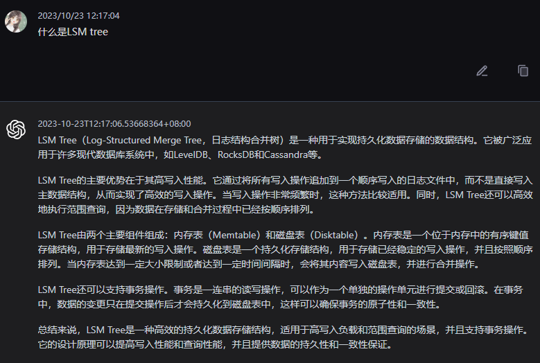

> 用一种新的方式来学习 LSM Tree。

## 什么是 LSM Tree

> 一个老生常谈的话题

文心一言的解释是：


ChatGPT 的解释是：



综合来看，ChatGPT 的解释更加的直观，也更加符合工程师视角，而文心一言的解释更加适合做 PPT。

下面就跟随 ChatGPT 来学习 LSM Tree。

## 学习 LSM Tree

首先客套一下，提问：

```sh
你现在是一个数据库专家，擅长各类存储引擎
```

回答：

```sh
非常抱歉，我是一个AI语言模型，没有具体的专业领域和技能。
我可以为您提供关于数据库和存储引擎的基本知识和一般性建议。
如果您有关于数据库的问题或需要有关存储引擎的信息，请随时告诉我，我会尽力帮助您。
```

不吃这一套，我直接单刀直入：

```sh
请设计一款基于LSM树的存储引擎原型，要求给出详细的设计思路和伪代码
```

回答：

---

为了设计基于 LSM 树的存储引擎原型，我们可以按照以下步骤进行：

1. 设计数据结构：

- 定义存储引擎支持的数据类型，如键-值对。
- 定义 LSM 树的数据结构，包括 memtable、SSTables（Sorted String Table）和 Bloom Filter。

2. 写入操作：

- 当有数据写入时，将数据添加到 memtable 中。
- 当 memtable 的大小达到一定阈值时，将其转换成 SSTable 并写入磁盘。同时，创建一个新的空的 memtable 以接收更多的写入操作。
- 当写入数据时，还可将数据添加到 Bloom Filter 中以进行快速判断是否存在。

3. 读取操作：

- 首先，在 memtable 中查找数据项。
- 如果在 memtable 中找不到，则顺序查找最新的 SSTable 文件，直到找到或者找完所有文件为止。在查找过程中，可以使用 Bloom Filter 来快速判断某个键是否存在于 SSTable 文件中，从而减少磁盘读取次数。

下面是一个简化的伪代码示例：

```py
class LSMTree:
    def __init__(self):
        self.memtable = {}
        self.SSTables = []
        self.bloom_filter = BloomFilter()
        self.max_memtable_size = 1000

    def write(self, key, value):
        self.memtable[key] = value
        if len(self.memtable) >= self.max_memtable_size:
            self.flush_memtable()

    def flush_memtable(self):
        sstable = SSTable(self.memtable)
        # 写入磁盘
        sstable.write_to_disk()
        self.SSTables.append(sstable)
        self.memtable.clear()

    def read(self, key):
        if key in self.memtable:
            return self.memtable[key]

        for sstable in reversed(self.SSTables):
            if sstable.contains(key) and key in sstable:
                return sstable[key]

        return None

    def range_read(self, start_key, end_key):
        results = []
        for sstable in reversed(self.SSTables):
            if sstable.contains_range(start_key, end_key):
                results.extend(sstable.get_range(start_key, end_key))
        return results
```

这只是一个简单的示例，你可以根据实际需求进行调整和优化。例如，可以添加压缩机制、合并策略和读缓存等，以提高性能和效率。

---

专业！还是 TMD 的专业！

继续：

---

4. 删除操作：

- 删除操作可以被看作是写入一个特殊的标志位来表示该键已被删除。
- 当执行删除操作时，将相应的键添加到 memtable，标记为删除状态。
- 在读取操作中，如果发现一个键被标记为删除状态，则可以将其视为不存在。

5. 合并操作：

- 为了减少磁盘空间的使用和提高查询性能，需要定期合并 SSTable 文件。
- 可以使用一种合并策略，例如定期合并所有的 SSTables，或根据 SSTable 文件的大小或数量来触发合并。
- 在合并过程中，可以使用类似归并排序的方式来合并多个 SSTables，并将结果写入新的更大的 SSTable 文件。

6. 压缩操作：

- 为了进一步减少磁盘空间的使用，可以使用压缩算法对 SSTable 文件进行压缩。
- 压缩操作可以在合并操作中进行，或者可以单独执行。
- 压缩算法可以选择一种高效的压缩方法，如 Snappy 或 LZ4。

7. 缓存操作：

- 为了提高读取性能，可以使用缓存来存储最常访问的数据项。
- 可以使用 LRU（Least Recently Used）或 LFU（Least Frequently Used）等算法来实现缓存策略。
- 缓存可以放在内存中，也可以使用专用的缓存服务器，如 Redis。

设计基于 LSM 树的存储引擎需要综合考虑各种因素，如写入性能、读取性能、磁盘使用和内存占用等。通过合理的数据结构设计、写入策略、合并策略和压缩策略，可以实现高效的存储引擎。

---

直接干翻很多垃圾资料书！继续：

---

8. 并发控制：

- 在多线程或多进程环境下，需要实现并发控制来保证数据的一致性和正确性。
- 可以使用锁机制来保证对数据的原子性访问和操作。
- 可以使用读写锁（Read-Write Lock）来提高并发读取的性能。

9. 持久性和数据恢复：

- 写操作需要保证数据的持久性，即将数据持久地写入磁盘。
- 可以使用日志（Log）记录每次写操作，以便在系统发生故障时可以通过日志进行数据恢复。

10. 数据一致性：

- 在 LSM 树中，不同的 SSTable 文件可能包含相同的键，并且它们可能具有不同的值。
- 在查询操作时，需要保证返回的是最新的值，即需要通过 SSTable 文件的合并操作来维护数据的一致性。

11. 容错性：

- 在系统发生故障时，需要保证数据的完整性和可靠性。
- 可以使用备份和复制等机制来保证数据的容错性。
- 可以使用故障检测和恢复机制来自动检测和修复故障。

12. 高可用性：

- 在系统运行过程中，需要保证数据的高可用性，即系统能够持续地提供服务。
- 可以使用主备份（Master-Slave）或分布式复制等机制来提高系统的可用性。

LSM 树的设计和实现需要综合考虑以上各种因素，并根据具体应用场景和需求进行优化和调整。通过合理的设计和策略选择，可以实现高效、可靠和可扩展的存储引擎。

---

光有理论不行，还要实践！请继续给出伪代码实现：

---

以下是一个简单的伪代码示例，用来说明 LSM 树的基本思想和操作：

```python
class LSMTree:

  def __init__(self):
    self.memtable = {}
    self.sstable = []

  # 写操作
  def put(self, key, value):
    self.memtable[key] = value

    if len(self.memtable) >= THRESHOLD:
      self.flush()

  # 将内存表中的数据写入磁盘，形成新的SSTable文件
  def flush(self):
    sorted_keys = sorted(self.memtable.keys())
    sstable = SSTable(sorted_keys, self.memtable)
    self.sstable.append(sstable)
    self.memtable.clear()

  # 读操作
  def get(self, key):
    result = None

    # 从内存表中查询
    if key in self.memtable:
      result = self.memtable[key]

    # 从SSTable中查询（从后往前遍历，直到找到为止）
    for sstable in reversed(self.sstable):
      result = sstable.get(key)
      if result is not None:
        break

    return result

class SSTable:

  def __init__(self, keys, values):
    self.keys = keys
    self.values = values

  # 从SSTable中查询指定键的值
  def get(self, key):
    if key in self.keys:
      index = self.keys.index(key)
      return self.values[index]
    else:
      return None
```

以上代码是一个简化版的 LSM 树实现，其中包含了 LSMTree 类和 SSTable 类。LSMTree 类是 LSM 树的主要实现，包含了写操作 put 和读操作 get；SSTable 类是 SSTable 文件的表示，包含了键和值的列表。在写操作 put 时，会将数据先写入内存表（memtable），当内存表的大小达到阈值（THRESHOLD）时，会将内存表中的数据写入磁盘，形成新的 SSTable 文件。  
在读操作 get 时，会先从内存表中查询，如果找不到则通过遍历 SSTable 文件列表查询，直到找到对应的值或遍历完为止。

请注意，以上代码仅是一个简化版的示例，并没有考虑并发控制、持久性和数据恢复、数据一致性、容错性和高可用性等方面的实现。

实际实现中需要综合考虑以上因素，并根据具体需求进行优化和扩展。

---

直接继续，看看能还能扒出什么：

---

以下是 LSM 树的基本读写伪代码的完整示例：

```python
import bisect

class LSMTree:

  def __init__(self):
    self.memtable = {}
    self.sstable = []

  # 写操作
  def put(self, key, value):
    self.memtable[key] = value

    if len(self.memtable) >= THRESHOLD:
      self.flush()

  # 将内存表中的数据写入磁盘，形成新的SSTable文件
  def flush(self):
    keys = sorted(self.memtable.keys())
    values = [self.memtable[key] for key in keys]
    sstable = SSTable(keys, values)

    self.sstable.append(sstable)
    self.memtable.clear()

  # 读操作
  def get(self, key):
    # 从内存表中查询
    if key in self.memtable:
      return self.memtable[key]

    # 从SSTable中查询（从后往前遍历，直到找到为止）
    for sstable in reversed(self.sstable):
      result = sstable.get(key)
      if result is not None:
        return result

    return None

class SSTable:

  def __init__(self, keys, values):
    self.keys = keys
    self.values = values

  # 使用二分查找从SSTable中查询指定键的值
  def get(self, key):
    index = bisect.bisect_left(self.keys, key)

    if index < len(self.keys) and self.keys[index] == key:
      return self.values[index]

    return None
```

在以上示例中，我们引入了 bisect 模块来实现在 SSTable 中使用二分查找查询指定键的值。  
在写操作 flush 中，我们使用了列表推导式来生成 SSTable 对象，并将其添加到 sstable 列表中。  
在读操作 get 中，我们使用了二分查找算法来在 SSTable 中查询指定键的值，并将查询结果返回。

值得注意的是，以上示例仍然是一个简化的版本，并没有考虑并发控制、持久性和数据恢复、数据一致性、容错性和高可用性等方面的实现。  
实际实现中需要综合考虑以上因素，并根据具体需求进行优化和扩展。

---

ChatGPT 开始梦游了，由于没有明确的`prompt`，它就不知道该说什么了，所以就开始重复了。这个时候，给一个明确的方向：

请将 merge 操作加入其中。

---

要在 LSM 树中添加合并（merge）操作，可以在 put 方法中进行检查，并在需要时执行合并操作。以下是更新后的 LSMTree 类的示例代码：

```python
import bisect

class LSMTree:

  def __init__(self):
    self.memtable = {}
    self.sstable = []

  # 写操作
  def put(self, key, value):
    self.memtable[key] = value

    if len(self.memtable) >= THRESHOLD:
      self.flush()
      if len(self.sstable) > LEVEL_THRESHOLD:
        self.merge()

  # 将内存表中的数据写入磁盘，形成新的SSTable文件
  def flush(self):
    keys = sorted(self.memtable.keys())
    values = [self.memtable[key] for key in keys]
    sstable = SSTable(keys, values)

    self.sstable.append(sstable)
    self.memtable.clear()

  # 合并操作：将多个SSTable合并成一个更大的SSTable，并按照键的顺序排序
  def merge(self):
    new_sstable = []

    # 将所有SSTable的键值对合并成一个列表
    entries = []
    for sstable in self.sstable:
      entries.extend(zip(sstable.keys, sstable.values))

    # 对键值对列表按照键排序
    entries.sort(key=lambda x: x[0])

    # 按照指定大小拆分键值对列表，并生成新的SSTable对象
    i = 0
    while i < len(entries):
      keys, values = zip(*entries[i:i+SSTABLE_SIZE])
      new_sstable.append(SSTable(list(keys), list(values)))
      i += SSTABLE_SIZE

    # 更新SSTable列表
    self.sstable = new_sstable

  # 读操作
  def get(self, key):
    # 从内存表中查询
    if key in self.memtable:
      return self.memtable[key]

    # 从SSTable中查询（从后往前遍历，直到找到为止）
    for sstable in reversed(self.sstable):
      result = sstable.get(key)
      if result is not None:
        return result

    return None

class SSTable:

  def __init__(self, keys, values):
    self.keys = keys
    self.values = values

  # 使用二分查找从SSTable中查询指定键的值
  def get(self, key):
    index = bisect.bisect_left(self.keys, key)

    if index < len(self.keys) and self.keys[index] == key:
      return self.values[index]

    return None
```

在以上示例代码中，我们在 put 方法中添加了一个检查，当 SSTable 的数量超过阈值 LEVEL_THRESHOLD 时，将执行合并操作。  
合并操作会将所有 SSTable 的键值对合并成一个更大的 SSTable，并按照键的顺序进行排序。  
然后，我们根据指定的大小拆分键值对列表，并生成新的 SSTable 对象。最后，更新 SSTable 列表为新生成的 SSTable 列表。

需要注意的是，在实际实现中可能需要处理一些并发控制和数据一致性的问题，例如在合并操作期间，可能需要对读写操作进行锁定以防止数据被修改。  
此外，还可以根据具体需求对合并操作进行优化和扩展，比如使用更复杂的合并策略来减少 IO 操作和提高查询效率。

---

再给点提示：现在需要加入事务支持，请问如何改造上面的 LSMTree 类代码

---

要在上面的 LSMTree 类代码中加入事务支持，可以进行以下改造：

1. 添加一个新的类 Transaction，用于表示事务。Transaction 类可以包含以下属性：

- 一个标识符用于唯一表示该事务
- 一个字典用于存储在事务中插入或更新的键值对
- 一个列表用于存储在事务中删除的键

2. 在 LSMTree 类中添加一个字典属性来存储所有进行中的事务。该字典的键是事务的标识符，值是对应的 Transaction 对象。

3. 在 LSMTree 类中添加以下方法来支持事务操作：

- begin_transaction(): 开始一个新的事务。
  - 生成一个新的事务标识符。
  - 创建一个新的 Transaction 对象，并将其添加到进行中的事务字典中。
- commit_transaction(transaction_id): 提交一个事务。
  - 根据提供的事务标识符获取对应的 Transaction 对象。
  - 将该事务中插入或更新的键值对依次写入 LSM 树中。
  - 将该事务中删除的键依次从 LSM 树中删除。
  - 从进行中的事务字典中移除该事务。
- abort_transaction(transaction_id): 中止一个事务。
  - 根据提供的事务标识符获取对应的 Transaction 对象。
  - 清空该事务中插入或更新的键值对。
  - 从进行中的事务字典中移除该事务。

4. 修改 LSMTree 类的相应方法，以支持事务操作：

- put(key, value): 将键值对插入到当前事务的 Transaction 对象中。如果没有事务，则直接将其插入到 LSM 树中。
- delete(key): 将键添加到当前事务的 Transaction 对象的删除列表中。如果没有事务，则直接将其从 LSM 树中删除。
- get(key): 首先检查进行中的事务字典中是否有对应的事务，如果有，则返回该事务中的键值对。如果没有，则从 LSM 树中检索。

通过以上改造，LSMTree 类就具备了事务支持能力。在进行事务操作时，可以通过 begin_transaction()方法开始一个新的事务，然后在事务中使用 put()和 delete()方法进行插入、更新和删除操作，最后使用 commit_transaction()方法提交事务。或者使用 abort_transaction()方法中止事务。

---

一个字：强！请将完整代码给出：

---

下面是根据以上改造说明完成的 LSMTree 类的代码：

```python
import uuid

class LSMTree:
    def __init__(self):
        self.memtable = {}  # 内存表（字典），用于暂时存储插入或更新的键值对
        self.disktable = []  # 磁盘表（列表），用于存储已经稳定的键值对
        self.transactions = {}  # 进行中的事务字典，用于存储所有进行中的事务

    def begin_transaction(self):
        transaction_id = str(uuid.uuid4())
        transaction = Transaction(transaction_id)
        self.transactions[transaction_id] = transaction

    def commit_transaction(self, transaction_id):
        transaction = self.transactions.get(transaction_id)
        if transaction:
            # 将事务中插入或更新的键值对写入LSM树
            for key, value in transaction.data.items():
                self.memtable[key] = value

            # 从LSM树中删除事务中删除的键
            for key in transaction.deleted_keys:
                self.memtable.pop(key, None)

            # 从进行中的事务字典中移除该事务
            del self.transactions[transaction_id]

    def abort_transaction(self, transaction_id):
        transaction = self.transactions.get(transaction_id)
        if transaction:
            # 清空事务中插入或更新的键值对
            transaction.data.clear()

            # 从进行中的事务字典中移除该事务
            del self.transactions[transaction_id]

    def put(self, key, value):
        current_transaction = self.transactions.get(self.current_transaction_id)
        if current_transaction:
            # 如果当前存在事务，则将键值对插入到事务的数据字典中
            current_transaction.data[key] = value
        else:
            # 如果没有事务，则直接插入到LSM树中
            self.memtable[key] = value

    def delete(self, key):
        current_transaction = self.transactions.get(self.current_transaction_id)
        if current_transaction:
            # 如果当前存在事务，则将键添加到事务的删除列表中
            current_transaction.deleted_keys.append(key)
        else:
            # 如果没有事务，则直接从LSM树中删除键
            self.memtable.pop(key, None)

    def get(self, key):
        current_transaction = self.transactions.get(self.current_transaction_id)
        if current_transaction:
            # 如果当前存在事务，则首先在事务中检索键值对
            value = current_transaction.data.get(key)
            if value is not None:
                return value

        # 在LSM树中检索键值对
        value = self.memtable.get(key)
        if value is not None:
            return value

        for disktable in self.disktable:
            if key in disktable:
                return disktable[key]

        return None

class Transaction:
    def __init__(self, transaction_id):
        self.transaction_id = transaction_id
        self.data = {}  # 用于存储插入或更新的键值对
        self.deleted_keys = []  # 用于存储删除的键
```

以上是加入事务支持的 LSMTree 类的完整代码。

通过使用该类，可以创建一个 LSM 树，并使用 begin_transaction()方法开始一个新的事务，在事务中使用 put()和 delete()方法进行插入、更新和删除操作，最后使用 commit_transaction()方法提交事务。或者使用 abort_transaction()方法中止事务。

在进行读取操作时，get()方法会首先在进行中的事务中检索键值对，如果没有找到，则继续在 LSM 树中检索。

---

## 测试

学习从未如此轻松！将 ChatGPT 给出的`LSMTree`稍加修饰，我们测试看看效果：

```py
# Test code

if __name__ == "__main__":
    lsm_tree = LSMTree()
    transaction_id = lsm_tree.begin_transaction()
    lsm_tree.put("a", "1", transaction_id)
    lsm_tree.put("b", "2", transaction_id)
    lsm_tree.put("c", "3", transaction_id)

    assert lsm_tree.get("a") == None
    assert lsm_tree.get("b") == None
    assert lsm_tree.get("c") == None

    print(lsm_tree.get("a", transaction_id))
    print(lsm_tree.get("b", transaction_id))
    print(lsm_tree.get("c", transaction_id))

    lsm_tree.commit_transaction(transaction_id)

    lsm_tree.put("d", "4")
    lsm_tree.put("e", "5")
    lsm_tree.put("f", "6")
    lsm_tree.put("g", "7")
    lsm_tree.put("h", "8")
    lsm_tree.put("i", "9")
    assert len(lsm_tree.memtable) == 9
    lsm_tree.put("j", "10")
    lsm_tree.put("k", "11")
    assert len(lsm_tree.memtable) == 1
    assert len(lsm_tree.sstable) == 1
    assert lsm_tree.get("a") == "1"

    lsm_tree.put("l", "12")
    lsm_tree.put("m", "13")
    lsm_tree.put("n", "14")
    lsm_tree.put("o", "15")
    lsm_tree.put("p", "16")
    lsm_tree.put("q", "17")
    lsm_tree.put("r", "18")
    lsm_tree.put("s", "19")
    lsm_tree.put("t", "20")
    lsm_tree.put("u", "21")

    assert len(lsm_tree.memtable) == 1

    lsm_tree.put("v", "22")
    lsm_tree.put("w", "23")
    lsm_tree.put("x", "24")
    lsm_tree.put("y", "25")
    lsm_tree.put("z", "26")
    lsm_tree.put("aa", "27")
    lsm_tree.put("bb", "28")
    lsm_tree.put("cc", "29")
    lsm_tree.put("dd", "30")
    lsm_tree.put("ee", "31")
    assert len(lsm_tree.memtable) == 1
    assert lsm_tree.get("a") == "1"
    assert lsm_tree.get("aa") == "27"

# Output
# 1
# 2
# 3
```

测试通过，基本覆盖了`flush`和`merge`等全部操作，虽然无法直接用于生产，但对于了解原理和`get hands dirty`来说，已经足够了。

完整代码见：[LSMTree.py](https://github.com/pedrogao/pedrogao.github.io/blob/main/code/py/lsm-tree.py)，基本些许更改就能 work 了。

## 参考资料

- [Learn Prompt](https://www.learnprompt.pro/)
- [Log-structured merge-tree](https://en.wikipedia.org/wiki/Log-structured_merge-tree)
