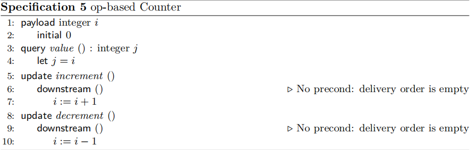
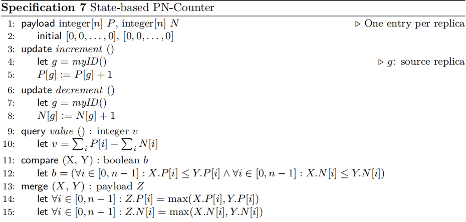
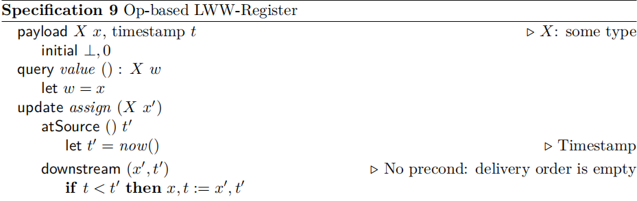

## 前言

CRDT 全称 _convergent or commutative replicated data type (CRDT)_，是近年来分布式领域的新宠。

与其它分布式系统不同，CRDT 在设计上放弃了**共识**；这意味着一个 CRDT 副本执行操作时，完全无需与其它副本进行协商，大大提升了副本执行效率。

没有协商并不代表副本数据之间会有差异，CRDT 通过良好的数据结构设计来使所有副本**最终达到一致**，但前提是任何副本执行的操作都必须通过网络传输并应用到其它副本，即使这些操作到达时是**乱序**的，但最后的数据仍然保证一致。

目前分布式系统普遍是 3 副本、5 副本，CRDT 可以直接将副本数量提升几个量级，如果允许网络延迟，这个数量还能成倍增加。

CRDT 最早可追溯到 2006 年的一篇[论文](https://dl.acm.org/doi/10.1145/1180875.1180916)，论文作者 Gérald 给出了主流协同算法 OT 存在不可解的 dirty case，并且 OT 实现十分复杂，不利于在分布式环境下扩展。

基于此，Gérald 提出了一种名为 _Without Operation Transformation (WOOT)_ 的协同算法，WOOT 算法是 CRDT 文本协同算法的鼻祖。

而在 2011 年，Marc 在其论文[Conflict-free Replicated Data Types](https://pages.lip6.fr/Marc.Shapiro/papers/RR-7687.pdf)中正式对 CRDT 给出了明确定义，详细探讨了分布式环境下，为了解决数据冲突从而达到最终一致性是十分困难的，而 CRDT 是一种优秀的可行解，论文还对 CRDT 最终一致性进行了严格证明。

由于 CRDT 出现较晚，本身又比较复杂，为了帮助更多人学习了解 CRDT，Marc 在 2011 同年发布了另外一篇 CRDT 论文:

[A comprehensive study of Convergent and Commutative Replicated Data Types](https://inria.hal.science/inria-00555588/document)

这篇论文详细的阐述了 CRDT 的原理，以及众多案例，并给出了诸多基础 CRDT 类型的伪代码实现，是不可多得的 CRDT 学习资源。

既然珠玉在前，本文对 CRDT 的介绍也会着重参考这几篇论文，当然原理推导、名词介绍不是本身重点，下文会简明其扼要，本文会将重点放在 CRDT 实践上，重点阐述如何实现 CRDT，以及如何运行它。

## 简单案例

CRDT（无冲突可复制数据类型）核心功能点，在于**无冲突可复制**，多个不同的数据副本分布在不同的客户端上，任意客户端都能即时编辑本地副本，无需与其它副本协调，并且保证最后的结果不会存在冲突。

这种特性天然适合多人协作场景，如文档共同编辑、阅读，多人聊天，多人画图等等。说起来挺玄乎的，下面就用一个简单的**Counter**样例来看看 CRDT 是如何工作且多方协同的：

---

<CounterDemo1></CounterDemo1>

---

如上，点击任意一方，增减数值，另外一端在及时收到操作后都能迅速达到双方一致的状态。点击 Network 按钮关闭掉网络，此时增减数值只会在本地生效，另外一段数值不会发生变化。

再次开启网络，则双向又会迅速达成一致。

而双方之所以能够丝滑的达成一致，核心是其核心数据**Counter**是通过 CRDT 来实现的，不仅如此，还可以发现：

- 编辑双方需要通过网络传输编辑操作，以便二者数据达到一致；
- CRDT 天然支持离线编辑，即时网络断开，本地仍可编辑，而无需与其它节点协商；
- CRDT 无需中心化服务器，P2P 即可实现多端协同；

即使编辑从双端扩展到多端，仍能保证多端的最终一致性，这就是 CRDT 的魅力。

## 简介

CRDT 的核心思想是**最终一致性**，即任意副本最终都能达到一致，但不保证实时一致，这意味着 CRDT 副本之间可以存在**不一致**，但最终都能达到一致。

CRDT 通过**数据结构**来保证最终一致性，而不是通过**协商**来保证最终一致性，这是 CRDT 与 OT 的最大区别。

CRDT 分为两大类：

- Operation-based CRDT: Commutative Replicated Data Type (CmRDT)
- State-based CRDT：Convergent Replicated Data Type (CvRDT)

二者目标一致，都是为了解决分布式环境下数据冲突的问题，从而达到最终一致性，不过达成一致的方式不同。

Operation-based CRDT 强调的是**操作**，即用户对数据的操作，而 State-based CRDT 强调的是**状态**，即数据的状态。

这也直接导致二者在设计上十分不同，具体有如下两点：

- 二者的数据结构不同，Operation-based CRDT 的数据结构核心是**操作**，而 State-based CRDT 的数据结构核心是**状态**；
- 通信数据不同，分布式环境下，多副本达成一致，彼此之间需要进行**通信**，二者在数据通信上也大不一样，简单说，Operation-based CRDT 交换操作，而 State-based CRDT 交换状态；

> CRDT 详细介绍请参考论文 [Conflict-free Replicated Data Types](https://pages.lip6.fr/Marc.Shapiro/papers/RR-7687.pdf)，本文的重点在于实践，  
> 对核心原理不做过多阐述，比如 CRDT 如何同时满足 CAP，如何保证强最终一致性等等，这些都是 CRDT 的基础，有兴趣的读者可以参考论文。

既然 CRDT 有两种类型，那么在**Counter**这个简单案例中，它们是如何实现的呢？会有哪些不同，下面就来看看 Op-based Counter 和 State-based Counter 的伪代码：

首先是 Op-based Counter：



Op-based Counter 在实现上颇为简单，增减只需改变本地状态`i`即可，而同步时，只需将本地操作`op`发送给其它节点即可，其它节点收到`op`后，执行`op`即可。

所以 Op-based Counter 的核心是**操作同步**，即图中公式的`downstream()`函数，具体关于如何实现在下面实践部分会详细介绍。

然后是 State-based Counter：



State-based Counter 在实现上稍微复杂一些，本地状态不再是一个简单的整数`i`，而是一个整数向量`N`，每个客户端都是向量 N 中的一项，增减时，客户端只能操作属于自己的项，即`N[g]`。

而同步时，本地向量`N`发送给其它节点，其它节点收到`N`后，需要将本地向量`N`与收到的向量 `N'` 进行合并，然后再更新本地向量 `N`。

> 摘自 [A comprehensive study of Convergent and Commutative Replicated Data Types](https://inria.hal.science/inria-00555588/document)

## 实践

纸上得来终觉浅，绝知此事要躬行，下面就来实践一下一些基础 CRDT 类型，包括：

- Counter：计数器；
- LWW-Register：单值寄存器；
- Multi-LWW-Register：多值存储，即 KV 哈希表存储；

这些基础 CRDT 类型，既能帮助我们理解 CRDT，也是以后工业级 CRDT 库（如 Yjs，Automerge 等）的基础。

### Counter

前面已经介绍了 Op-based Counter 和 State-based Counter 的算法伪代码，下面分别来实现一下。

#### Op-based Counter

首先是 [Op-based Counter](https://github.com/pedrogao/pedrogao.github.io/blob/main/docs/.vuepress/lib/crdt/counter.ts) 的实现 OBCounter：

```js
export class OBCounter {
  value: number;
  clientId: string;
  clock: number;
  ops: Op<number>[];
  vector: Map<string, number>;

  public constructor(init: number = 0, clientId?: string) {
    this.value = init;
    this.clientId = clientId ?? randomString(6);
    this.clock = 0;
    this.ops = [];
    this.vector = new Map();
  }
  // ...
}
```

- `value`：本地状态，即计数器的值；
- `clientId`：客户端 ID，用于标识客户端；
- `clock`：本地时钟，用于生成操作 ID；
- `ops`：操作数组，用于存储操作；
- `vector`：向量时钟，用于存储其它客户端的时钟；

> `value` 每次变更都会增加`clock`的值，`vector` 时钟的 key 是客户端 ID，value 是客户端的时钟 clock；

OBCounter 的核心是`ops`数组，每个元素都是一个操作，即`Op`类型，`Op`类型定义如下：

```js
export enum OpType {
  // Counter op types
  Increment = "increment",
  Decrement = "decrement",
}
export type Op<T> = {
  type: OpType;
  value: T;
  id: Id;
};
```

- `type`：操作类型，即增加或减少；
- `value`：操作值，即增加或减少的值；
- `id`：操作 ID，用于标识操作；

`id` 是一个元组：

```js
export type Id = [string, number];
```

由客户端 ID 和本地时钟组成，即`clientId:clock`，如`client1:1`，`client1:2`，`client2:1`，`client2:2`等等，这样既能保证操作 ID 的唯一性，也能保证不同客户端的操作 ID 之间是可比较的，即`client1:1` < `client1:2` < `client2:1` < `client2:2`。

这种设计思想其实是[Lamport timestamp](https://en.wikipedia.org/wiki/Lamport_timestamp)的具体实现，关于 Lamport timestamp 可以参考[这里](https://en.wikipedia.org/wiki/Lamport_timestamp)。

`Id`可以标识每个`Op`的唯一性，`vector`用来记录不同客户端的 op 应用状态，避免重复应用 op 导致副本之间状态不一致。

OBCounter 本地状态变更有两个核心方法：

- `increment`：增加计数器；
- `decrement`：减少计数器；

```js
  public increment(): void {
    this.value++;
    this.ops.push({
      type: OpType.Increment,
      value: 1,
      id: [this.clientId, this.clock++],
    } as Op<number>);
  }

  public decrement(): void {
    this.value--;
    this.ops.push({
      type: OpType.Decrement,
      value: 1,
      id: [this.clientId, this.clock++],
    } as Op<number>);
  }
```

每次变更都会增加`clock`的值，同时将变更的操作添加到`ops`数组中。

需要读取计数器值时，调用`get`方法：

```js
  public get(): number {
    return this.value;
  }
```

需要将本地状态同步到其它节点时，调用`flush`方法：

```js
  public flush() {
    return this.ops;
  }
```

将本地的`ops`数组返回，其它节点收到`ops`数组后，调用`apply`方法依次应用`op`：

```js
  public apply(op: Op<number>): void {
    const id = op.id;
    const clock = this.vector.get(id[0]) ?? -1;
    // Ignore old ops
    if (clock >= id[1]) {
      return;
    }
    // New op must match clock sequence
    if (clock + 1 !== id[1]) {
      throw new Error(`Op id not in order: ${clock} ${id[1]}`);
    }

    if (op.type === OpType.Increment) {
      this.value += op.value;
    } else if (op.type === OpType.Decrement) {
      this.value -= op.value;
    } else {
      throw new Error(`Unsupport op type: ${op.type}`);
    }
    this.vector.set(id[0], id[1]);
  }
```

注意，`op`应用完成后，需立即更新`vector`时钟，否则会导致重复应用`op`；在 `apply` 方法中就针对 `vector` 做了 op 去重操作，避免 op 污染。

调用`flush()`得到 ops 后，当前节点需要感知其它节点应用 op 成功的事件，否则下次调用仍会返回相同的 ops，这里可以通过`ack`来确认 op 应用成功，避免下次重复发送：

```js
  public ack(op: Op<number>): void {
    this.ops = this.ops.filter((o) => !Id.equals(o.id, op.id));
  }
```

至此，一个简单的 OBCounter 就实现了，可以通过上面`Counter`[demo](https://github.com/pedrogao/pedrogao.github.io/blob/main/docs/.vuepress/views/CounterDemo1.vue) 来体验一下。

#### State-based Counter

[State-based Counter](https://github.com/pedrogao/pedrogao.github.io/blob/main/docs/.vuepress/lib/crdt/counter.ts) 的实现思路和 OBCounter 大不一样，由于 SBCounter 核心在于状态，为了保存所有客户端的数值状态，我们需要一个`Map`来保存；在通信上，由于传输的数据内容是状态，因此也无需 op，直接传输状态即可。

```js
export class SBCounter {
  clientId: string;
  s1: Map<string, number>;
  s2: Map<string, number>;

  public constructor(clientId?: string) {
    this.clientId = clientId ?? randomString(6);
    this.s1 = new Map();
    this.s2 = new Map();
  }
}
```

- `clientId`：客户端 ID，用于标识客户端；
- `s1`：保存当前`增值`状态；
- `s2`：保存当前`减值`状态；

SBCounter 本地状态变更有两个核心方法：

- `increment`：增加计数器；
- `decrement`：减少计数器；

```js
  public increment(): void {
    this.s1.set(this.clientId, (this.s1.get(this.clientId) ?? 0) + 1);
  }

  public decrement(): void {
    this.s2.set(this.clientId, (this.s2.get(this.clientId) ?? 0) + 1);
  }
```

每次变更都会将当前客户端的状态保存到`Map`中。读取计数时，调用`get`方法：

```js
  public get(): number {
    return (
      Array.from(this.s1.values()).reduce((a, b) => a + b, 0) -
      Array.from(this.s2.values()).reduce((a, b) => a + b, 0)
    );
  }
```

对于传输而来的远端状态，调用`merge`方法合并到本地：

```js
export type CounterState = {
  s1: Map<string, number>;
  s2: Map<string, number>;
};

  public merge(other: CounterState): void {
    for (const [k, v] of other.s1.entries()) {
      const old = this.s1.get(k) ?? 0;
      this.s1.set(k, Math.max(old, v));
    }

    for (const [k, v] of other.s2.entries()) {
      const old = this.s2.get(k) ?? 0;
      this.s2.set(k, Math.max(old, v));
    }
  }

    public toState(): CounterState {
    return {
      s1: this.s1,
      s2: this.s2,
    };
  }
```

下面就 SBCounter、OBCounter 两种实现进行一下简单对比：

|          | OBCounter                     | SBCounter                                              |
| -------- | ----------------------------- | ------------------------------------------------------ |
| 本地状态 | 1 个整数                      | 2 个 Map                                               |
| 通信内容 | 1 个整数，一个操作            | 2 个 Map                                               |
| 通信方式 | op                            | state                                                  |
| 实现成本 | 读写简单，核心在 op，需要防重 | 读写相对麻烦一点，需要状态合并，无需防重，核心在 state |

### LWW-Register

LWW-Register 全称 _Last Write Won Register_ 单值寄存器是 CRDT 另外一个重要的基础类型，它的特点是：

- 任何时刻只有一个值；
- 最后写入的值胜出；

> 寄存器是比较官方的名称，其实一个变量，就像 js 中的：  
> let a = "a";  
> 是一样的。

与 Counter 类似，LWW-Register 也有两种实现方式：基于 op 的实现和基于 state 的实现。

#### Operation-based LWW-Register

Operation-based LWW-Register 伪代码如下：



变量`x`在初始化时，需要携带一个`timestamp`标识 x 的声明周期，当 x 被修改时，需要更新`timestamp`，这样才能保证最后写入的值胜出。

具体的[实现](https://github.com/pedrogao/pedrogao.github.io/blob/main/docs/.vuepress/lib/crdt/register.ts)：

```js
export class OBLWWRegister<T> {
  value: T | null;
  clientId: string;
  clock: number;
  ops: Op<T>[];

  public constructor(init?: T, clientId?: string) {
    this.value = init ?? null;
    this.clientId = clientId ?? randomString(6);
    this.clock = 0;
    this.ops = [];
  }
}
```

- `value`：当前值；
- `clientId`：客户端 ID，用于标识客户端；
- `clock`：时间戳，用于标识当前值的声明周期；
- `ops`：保存所有变更操作；

仍然沿用上文谈到的 Lamport 时钟，每次变更时，都会递增`clock`作为`timestamp`，并将变更操作保存到`ops`中：

```js
  public set(value: T): void {
    this.value = value;
    this.ops.push({
      type: OpType.Set,
      value: value,
      id: [this.clientId, ++this.clock],
    } as Op<T>);
  }
```

读取值十分简单：

```js
  public get(): T | null {
    return this.value;
  }
```

既然是基于 op 实现，那么 `apply`，`ack` 也基本一致：

```js
  public apply(op: Op<T>): void {
    const id = op.id;
    // Ignore old ops
    if (this.clock > id[1]) {
      return;
    }
    if (this.clock === id[1] && this.clientId > id[0]) {
      return;
    }

    if (op.type === OpType.Set) {
      this.value = op.value;
      this.clock = id[1];
    } else {
      throw new Error(`Unsupport op type: ${op.type}`);
    }
  }

  public ack(op: Op<T>): void {
    this.ops = this.ops.filter((o) => !Id.equals(o.id, op.id));
  }

  public flush() {
    return this.ops;
  }
```

`clock`和`vector`来实现 op 去重。

OBLWWRegister 可通过下面的 [demo](https://github.com/pedrogao/pedrogao.github.io/blob/main/docs/.vuepress/views/RegisterDemo.vue) 来体验：

---

<RegisterDemo></RegisterDemo>

---

在左侧输入框输入任何内容，都能被同步到右侧展示区，反之亦然。

#### State-based LWW-Register

State-based LWW-Register 伪代码如下：


与 SBCounter 相比，SBLWWRegister [实现](https://github.com/pedrogao/pedrogao.github.io/blob/main/docs/.vuepress/lib/crdt/register.ts)更加简单，由于`value`是时间戳大的一方获胜，因此 merge 时，只需判断双方`clock`大小即可，如果相等，则判断双方 clientId 大小：

```js
export class SBLWWRegister<T> {
  clientId: string;
  value: T | null;
  clock: number;

  public constructor(init?: T, clientId?: string) {
    this.value = init ?? null;
    this.clientId = clientId ?? randomString(6);
    this.clock = 0;
  }

  public get(): T | null {
    return this.value;
  }

  public set(value: T): void {
    this.value = value;
    this.clock++;
  }

  public merge(state: RegisterState<T>): void {
    if (this.clock > state.id[1]) {
      return;
    }
    if (this.clock === state.id[1] && this.clientId > state.id[0]) {
      return;
    }
    this.value = state.value;
    this.clock = state.id[1];
  }
}
```

当然，也别忘记在`set`变更值时，递增`clock`。

### Multi-LWW-Register(Map)

`LWWRegister` 用于表示一个变量，在其基础上，我们可以扩展出多个变量，即`MultiLWWRegister`，实际上这就是 `Map` 的 CRDT 实现。

MultiLWWRegister [实现](https://github.com/pedrogao/pedrogao.github.io/blob/main/docs/.vuepress/lib/crdt/register.ts)上也必须能支持多个值：

```js
export class MultiLWWRegister<T> {
  map: Map<string, T | null>;
  clientId: string;
  clock: number;
  ops: Op<string>[];

  public constructor(clientId?: string) {
    this.map = new Map();
    this.clientId = clientId ?? randomString(6);
    this.clock = 0;
    this.ops = [];
  }
}
```

- `map`：用于保存多个变量，key 是变量名，value 是变量值；
- `clientId`：客户端 ID，用于标识客户端；
- `clock`：时间戳；
- `ops`：保存所有变更操作；

读取值，调用 `get` 方法：

```js
  public get(key: string): T | null {
    return this.map.get(key) ?? null;
  }
```

通过 `set` 方法设置值：

```js
  public set(key: string, value: T): void {
    this.map.set(key, value);
    this.ops.push({
      type: OpType.KV,
      value: JSON.stringify([key, value]),
      id: [this.clientId, ++this.clock],
    } as Op<string>);
  }
```

并将变更操作保存到`ops`中。

与其它基于 op 的 CRDT 一样，MultiLWWRegister 也需要 `apply`，`flush` 应用、传输 op：

```js
  public apply(op: Op<string>): void {
    const id = op.id;
    // Ignore old ops
    if (this.clock > id[1]) {
      return;
    }
    if (this.clock === id[1] && this.clientId > id[0]) {
      return;
    }

    if (op.type === OpType.KV) {
      const [key, value] = JSON.parse(op.value);
      this.map.set(key, value);
      this.clock = id[1];
    } else {
      throw new Error(`Unsupport op type: ${op.type}`);
    }
  }

  public ack(op: Op<string>): void {
    this.ops = this.ops.filter((o) => !Id.equals(o.id, op.id));
  }

  public flush() {
    return this.ops;
  }
```

核心在`apply`上，当发现 op 的时间戳小于当前时间戳，或者时间戳相等但 clientId 大于当前 clientId 时，忽略该 op，就样就能保证此时的值是最新的。

MultiLWWRegister 可通过下面的 [demo](https://github.com/pedrogao/pedrogao.github.io/blob/main/docs/.vuepress/views/MulRegisterDemo.vue) 来体验：

---

<MulRegisterDemo></MulRegisterDemo>

---

## 结语

本文旨在介绍一些基础 CRDT 类型，为以后深入理解文本 CRDT 算法做铺垫。

回顾一下，本篇文章简单介绍了 CRDT 的基本概念，以及常见的几种 CRDT 实现，包括：

- Counter;
- Register;
- Multi-Register(Map);

而 CRDT 的类型还有 Set，Graph 等，感兴趣的可以参考[A comprehensive study of Convergent and Commutative Replicated Data Types](https://inria.hal.science/inria-00555588/document)。

## 参考资料

- [Data consistency for P2P collaborative editing](https://dl.acm.org/doi/10.1145/1180875.1180916)
- [Conflict-free Replicated Data Types](https://pages.lip6.fr/Marc.Shapiro/papers/RR-7687.pdf)
- [A comprehensive study of Convergent and Commutative Replicated Data Types](https://inria.hal.science/inria-00555588/document)
- [CRDT 简介](https://www.zxch3n.com/crdt-intro/crdt-intro/)
- [如何设计 CRDT 算法](https://www.zxch3n.com/crdt-intro/design-crdt/)
- [An Interactive Intro to CRDTs](https://jakelazaroff.com/words/an-interactive-intro-to-crdts/#user-content-fn-ackshually)
- [Lamport timestamp](https://en.wikipedia.org/wiki/Lamport_timestamp)
