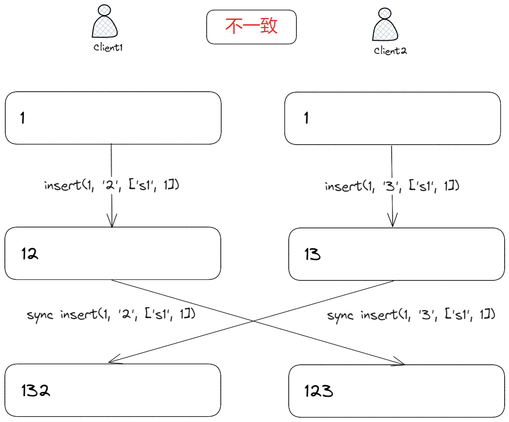
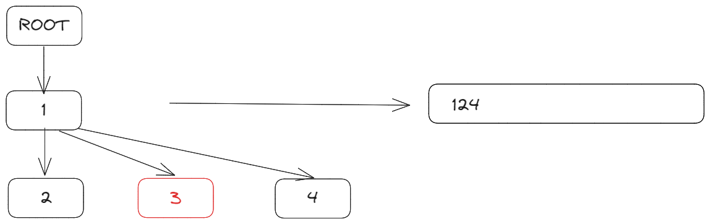
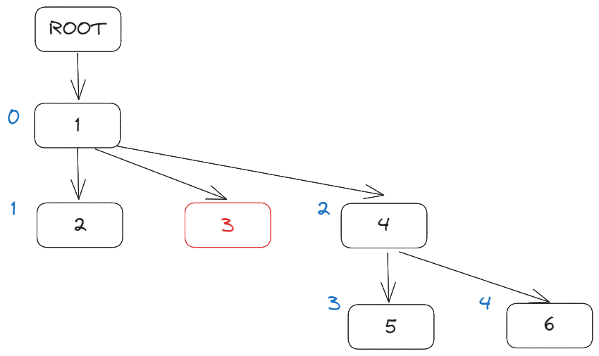
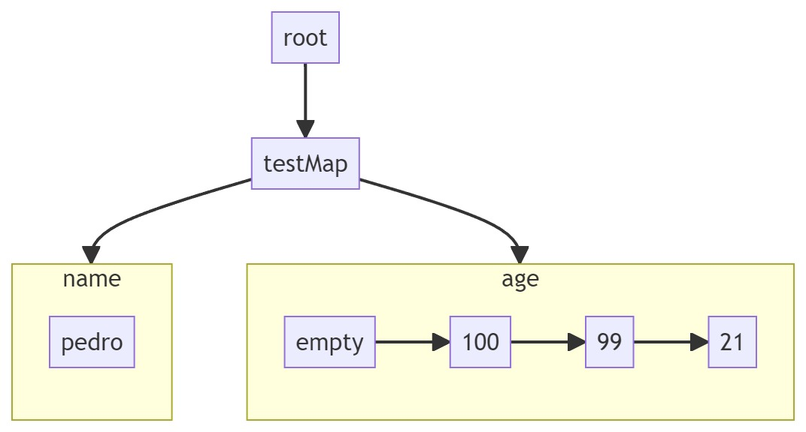
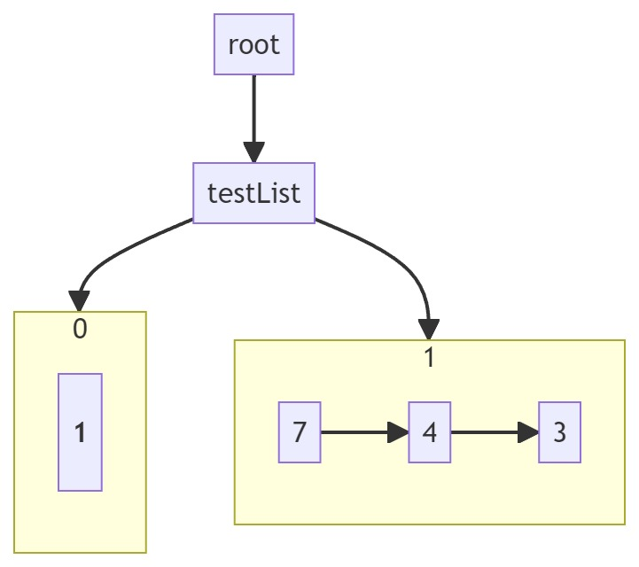

## 前言

[上一篇文章](./crdt1.md)我们介绍了 CRDT 的基本概念，探讨了一些基础 CRDT 的实现。从本篇文章开始，我们将深入两种 CRDT 算法：

- [RGA](http://csl.skku.edu/papers/jpdc11.pdf)
- [YATA](https://www.researchgate.net/publication/310212186_Near_Real-Time_Peer-to-Peer_Shared_Editing_on_Extensible_Data_Types)

这两种算法分别是知名 CRDT 库 Automerge 和 Yjs 所采用的算法，被广泛应用于生产环境，是深入 CRDT 应用的基础。

本篇文章我们将介绍 RGA 算法，下一篇文章我们将介绍 YATA 算法。

## RGA

RGA 全称 Replicate Growable Array 可复制增长数组，由 Hyun 于 2011 年在论文[Replicated abstract data types: Building blocks for collaborative applications](http://csl.skku.edu/papers/jpdc11.pdf)中提出（2011 年真的是 CRDT 爆发的一年）。

> 千万别被名字吓到了，其实 RGA 就是列表的 CRDT 实现。论文原话是：  
> growable array is the Vector class of JAVA or STL.

论文中提到 RGA 在有序复制集合上拥有良好的插入、删除性能，优于已有的 OT 算法，适合用于协同文本编辑场景。

当然 RGA 不仅适用于有序文本，同时也能推广到有序列表，哈希表等场景，因此 RGA 也是 Automerge 库的基础。

论文中，给出了 RGA 基于双向链表实现的部分伪代码，如下：


伪代码实现十分简单，无论是插入还是删除，都是在链表中排除已删除项，找到`i`对应的位置，然后插入或删除即可。

不过，双向链表显然无法满足大文本编辑、查找等场景的性能要求，因此有不少优化版的 RGA 实现，比如：

- [Automerge](https://automerge.org/) 中 RGA 是基于 B+树实现的；
- [Cola](https://nomad.foo/blog/cola)中 RGA 是基于 G-tree 实现的；
- [RGATreeSplit](https://pages.lip6.fr/Marc.Shapiro/papers/rgasplit-group2016-11.pdf)使用平衡树来优化 RGA；

## 案例

下面，以[纯文本协同编辑](https://github.com/pedrogao/pedrogao.github.io/blob/main/docs/.vuepress/views/RGADemo.vue)为例，看看 RGA 是如何工作的。

---

<RGADemo></RGADemo>

---

> 只支持简单的英文、数字文本增、删，不支持中文、复制粘贴等操作。  
> 没办法，input 中文事件笔者不会啊。

在左侧输入框中编辑文本内容，都会同步到对方，最终保证两个输入框的内容一致。

## 推演

文本内容本质上是**插入操作的集合**，因此我们可以通过插入操作来推演 RGA 的工作原理。

下面，以**纯文本**协同编辑为例，看看 RGA 是保证多方编辑内容最终一致的。

首先，我们看一个最简单的例子：**有且只有一个客户端进行编辑**


客户端 1 在位置`0`插入字符`1`，并将插入操作(op)同步到客户端 2，客户端 2 收到 op 并应用后，将`1`插入到位置`0`，此时客户端 1 和客户端 2 的文本内容是一致的。

因为只有客户端 1 有编辑操作，其它客户端处于只读状态，那么就不能产生**编辑冲突**，因此最后的文本内容肯定是一致的。

可一旦有多个客户端同时进行编辑，就会产生**编辑冲突**，导致最终文本内容不一致，比如：


客户端 1、2 分别在位置`1`插入字符`2`、`3`，并将插入操作(op)同步到对方应用后，此时客户端 1 和客户端 2 的文本内容不一致。

而产生不一致的原因是，操作同步的数据：

```js
insert(1, "2");
```

虽然携带了插入位置`1`和插入数据`2`，但没有其它约束条件，导致最终文本内容不一致。

我们可以通过**插入意图**来解决这个问题：

```js
client1: insert(1, "2", "1");
client2: insert(1, "3", "1");
```

这里，`"1"`就是插入意图，表示在`1`之后插入`2`，`3`，但这样就能保证最终文本内容一致吗？

显然是不能的，因为`1`虽然是插入意图，但是文本中可能存在多个`1`，比如：


我们为每个插入字符都添加一个唯一的标识符 Id，比如字符`1`的 Id：

```ts
// [siteId, counter]
export type Id = [string, number];
```

`Id` 包括两部分，第一部分是客户端的唯一标识符，第二部分是客户端操作的序号，这样就能保证每个字符都有唯一的 Id。

有了 Id 后，操作同步数据就变成了：

```js
// params:
// 1. 插入位置
// 2. 插入数据
// 3. 插入意图，即当前插入位置字符的 Id
insert(1, "2", ["site1", 1]);
```

这样能够保证最终文本内容一致了吗？如下：



客户端 1、2 分别在位置`1`插入字符`2`、`3`，因为两个插入操作的意图是一致的，都插入在字符`1`右侧，但字符`2`，`3`之间位置暂时不知如何排列，从而导致最终文本内容不一致。

我们可以通过字符`2`，`3`的 Id 来解决二者之间的插入排序问题，即：

```js
client1: insert(1, { id: ["site1", 2], content: "2" }, ["site1", 1]);
client2: insert(1, { id: ["site2", 1], content: "3" }, ["site1", 1]);
```

**约定**，如果插入意图一致，那么就按照字符 Id 来排序：

- 如果`counter`不同，那么按照`counter`排序，大者在右边；
- 如果`counter`相同，那么按照`siteId`排序，大者在右边；

有了排序后，最终文本内容就一致了：


最后，来看看删除操作，我们将**一次插入**抽象为一个`Item`，即：

```ts
export type Item<T> = {
  content: T | null; // 插入内容
  id: Id; // Id
  parent: Id | null; // 插入意图
};
```

至于删除，最容易想到的是将`Item`直接删除掉，但这显然不行，因此不同客户端可能在同一个插入意图上工作，如果将字符删除掉了，那么意图也就丢失了，文本最终内容也就不一致了。

因此，我们不能直接删除`Item`，而是引入**墓碑机制**，即：

```ts
export type Item<T> = {
  content: T | null; // 插入内容
  id: Id; // Id
  isDeleted: boolean;
  parent: Id | null; // 插入意图
};
```

删除`Item`时，将`isDeleted`设置为 true，这样就能保留插入意图，从而保证最终文本内容一致。

## 实现

充分推演后，我们就能给出一个[简单 RGA 的实现](https://github.com/pedrogao/pedrogao.github.io/blob/main/docs/.vuepress/lib/crdt/rga.ts)了。

首先是数据建模，每个插入字符操作被抽象为一个`Item`：

```ts
export type Item<T> = {
  content: T | null; // root item has no content
  id: Id;
  isDeleted: boolean;
  children: Id[]; // children of this item
  parent: Id | null; // parent of this item
};
```

- `parent`：插入意图；
- `children`：子节点，每个字符都可能成为多个字符的意图，因此子节点可能有多个；

很明显，这样的数据结构导致文本内容是一个树：


> ROOT 节点是虚拟节点，标识文档的开始，没有实际意义。

因此我们可以使用`Map`来存储`Item`，其中`key`是`Item.id`，`value`是`Item`。

```ts
export class Doc<T> {
  root: Id;
  length: number;
  vector: Vector;
  clientId: string;
  store: Map<string, Item<T>>;

  public constructor(clientId?: string) {
    const cid = clientId ?? randomString(6);
    const root = {
      content: null,
      id: [cid, 0],
      isDeleted: false,
      children: [],
      parent: null,
    } as Item<T>;

    // Root item should insert at the beginning, and could not be deleted or updated
    this.root = root.id;
    this.length = 0; // Exclude root item
    this.vector = {
      [cid]: 0,
    };
    this.clientId = cid;
    this.store = new Map([[Id.hash(root.id), root]]);
  }
}
```

- `root`：文档的根节点，虚拟节点；
- `length`：文档长度，不包括根节点；
- `vector`：客户端向量；
- `clientId`：客户端唯一标识符；
- `store`：存储`Item`的`Map`；

新建`Doc`时，向`store`中插入根节点，同时设置`length`、`vector`。

由于整个文档是一颗树，每个字符是其中一个节点，获取文档内容时，我们需要遍历整个树，将所有字符拼接起来：



```ts
  public getContent(): T[] {
    const doc = this;
    const content: T[] = [];
    const queue: Id[] = [];

    queue.push(doc.root);
    while (queue.length > 0) {
      const id = queue.shift()!;
      const item = doc.store.get(Id.hash(id))!;
      if (!item.isDeleted && item.content !== null) {
        content.push(item.content);
      }
      queue.push(...item.children);
    }

    return content;
  }
```

由于字符`3`被软删除掉了，因此最终文本内容是`[1, 2, 4]`。

接下来是插入操作，插入操作的核心是生成`Item`，然后将集成(intergrate，下文再详谈)到文档树中。

```ts
  public insert(pos: number, content: T) {
    const item = this.findItemByIndex(pos - 1);
    if (!item) {
      throw new Error("Item not found");
    }

    const newItem = {
      content,
      id: [this.clientId, this.vector[this.clientId] + 1],
      isDeleted: false,
      children: [],
      parent: item.id,
    } as Item<T>;

    this.integrate(newItem);
  }
```

`insert`将字符插入到`pos`位置，因此需要找到`pos-1`位置的`Item`作为其插入意图 parent，然后生成新的`Item`，最后将其集成到文档树中。

`findItemByIndex`使用 DFS 遍历文档树，排除掉删除字符，找到`pos`位置的`Item`：



```ts
  private findItemByIndex(pos: number): Item<T> | null {
    if (pos === -1) {
      return this.store.get(Id.hash(this.root))!;
    }

    const queue: Id[] = [];
    let i = pos;
    // DFS
    queue.push(this.root);
    while (queue.length > 0) {
      const id = queue.shift()!;
      const item = this.store.get(Id.hash(id))!;
      if (item.content === null) {
        queue.push(...item.children);
        continue;
      }

      if (i === 0 && !item.isDeleted) {
        return item;
      }

      if (!item.isDeleted) {
        i--;
      }
      queue.push(...item.children);
    }

    return null;
  }
```

有了`findItemByIndex`有，删除就十分简单了：

```ts
  public delete(pos: number) {
    const item = this.findItemByIndex(pos);
    if (!item) {
      throw new Error("Item not found");
    }
    item.isDeleted = true;
    this.length -= 1;
  }
```

最后，解释一下最复杂的`integrate`：

```ts
private integrate(item: Item<T>) {
    const lastClock = this.vector[item.id[0]] ?? 0;
    const clock = item.id[1];
    if (lastClock >= clock) {
      // This item has been integrated
      return;
    }
    if (lastClock + 1 !== clock) {
      throw new Error("Clock not match");
    }
    this.vector[item.id[0]] = clock;
    // 1. Find the parent item
    // 2. Insert the new item to parent.children, compare the id of new item and the next item
    // 3. Update the version and length of doc
    const parent =
      item.parent![1] === 0
        ? this.store.get(Id.hash(this.root))!
        : this.store.get(Id.hash(item.parent!))!;
    if (!parent) {
      // Root item can not integrate
      throw new Error("Parent not found");
    }

    let destIndex = 0;
    for (; destIndex < parent.children.length; destIndex++) {
      const child = parent.children[destIndex];
      // Smaller id should at left
      if (item.id[0] <= child[0]) {
        break;
      }
    }

    parent.children.splice(destIndex, 0, item.id);
    this.store.set(Id.hash(item.id), item);
    if (!item.isDeleted && item.content !== null) {
      this.length += 1;
    }
  }
```

`integrate` 有三个核心步骤：

1. `clock`去重逻辑，如果`item`已经被集成到文档树中，那么就不需要再次集成了；
2. 找到`item`的`parent`，然后将`item`插入到`parent.children`中，这里需要注意的是，`item`的`id`需要和`parent.children`中的`id`进行比较，保证`id`小的在左边，大的在右边；
3. 更新`doc`的`length`和`vector`；

## TinyAutomerge

Automerge 是为数不多将 RGA 用在生产环境上的 CRDT 库，RGA 是 Automerge 中的核心算法部分，设计方式和实现思路都很有借鉴性。

笔者实现了一个 toy 版本：[TinyAutomerge](https://github.com/pedrogao/pedrogao.github.io/blob/main/docs/.vuepress/lib/crdt/automerge.ts)。

TinyAutomerge 是 Automerge 的一个极简版本，它是按照笔者个人理解以及 [Automerge 文档](https://cdnm67bsp6.feishu.cn/docx/UvbRdESXzor1PyxkTPvcA3xAn4b)来实现的，可以帮助我们更好的理解 Automerge 和 RGA。

> Automerge 中 RGA 的[实现文档](https://cdnm67bsp6.feishu.cn/docx/UvbRdESXzor1PyxkTPvcA3xAn4b)其实已经被官方文档删除掉了，笔者在 github 上找到了以前的 commit，然后将其复制到了飞书文档，希望能帮助到对 Automerge 感兴趣的人

TinyAutomerge 支持两种 CRDT 数据类型以及其基本操作：

- List(Text):
  - `insert(pos, content)`
  - `delete(pos)`
  - `put(pos, content)`
  - `get(pos)`
  - `range(start, end)`
- Map:
  - `put(key, value)`
  - `get(key)`
  - `delete(key)`
  - `range(start, end)`

> Text 纯文本本质上和 List 是一样的，因此这里没有额外实现。

下面就 Automerge 核心数据结构建模以及基本操作伪代码做一个简单的介绍。

### 数据结构建模

`TinyAutomerge`仍然以`Operation(操作)`作为核心建模方式，任何一个基本操作，包括`insert`、`delete`、`put`、`get`都可以被抽象为一个`Operation`：

```ts
export type Operation<T> = {
  id: OpId;
  prop: string; // map property name or array insert|update origin intention
  insert: boolean;
  value: T | null | "make(map)" | "make(list)"; // null means delete
  pred: OpId[];
  succ: OpId[];
};
```

这里的`OpId`其实也是 Lamport 时钟，也即是`[actorId, clock]`，`actorId`是一个字符串，`clock`是一个数字。

在`Automerge`中 actorId 其实就是`siteId`。

每个`Operation`都有唯一的`id`，`insert`字段表示是否为插入操作；

`prop`字段略微有点特殊，对于`Map`来说，`prop`就是`map`中的某个`key`，对于`List`来说，`prop` 操作意图，即插入位置前一项。

另外 `pred` 和 `succ` 字段分别标识操作的前驱、后继操作，以`Map`为例，如果多个`put`操作的`key`相同，那么这些`put`操作的`pred`和`succ`就会形成一个双链表，最后的操作在链表最后端。

如果`Operation`的 succ 不为空，证明这个`Operation`已经`过期`了，因为有新的`Operation`插入到了这个`Operation`之后。

而`delete`略有不同，因为 delete 没有实际的删除数据，只是将上一个`Operation`的`succ`指向自己，这样就可以将`Operation`从链表中软移除了。

同样地，文档是操作的集合：

```ts
type OpTree<T> = {
  parent: ObjId | null; // null means root
  objType: ObjType; // map or list
  store: Array<Operation<T>>; // sorted by OpId or Prop
};

type OpSet<T> = {
  // Op trees
  trees: Map<ObjId, OpTree<T>>;
  // The length of op array
  length: number;
};

export type Doc<T> = {
  ops: OpSet<T>;
  // The current actor.
  id: Actor;
  // The maximum operation counter this document has seen.
  maxOpCount: number;
};
```

`Doc`核心数据实际就是`op`的集合，即`OpSet`。OpSet 下可以有多个 OpTree，每个 `OpTree` 对应一个`Map`或者`List`，`OpTree` 中的`store`是一个操作有序数组，`parent`指向父节点，`objType`标识是`Map`还是`List`。

从这里就可以得出，对于`Map`和`List`的操作一般需要两步：

1. 在`OpSet`中找到对应的`OpTree`，如果没有就创建一个；
2. 在`OpTree`中查找、变更、对应的`Operation`；

### Map

了解了基本数据结构后，我们就可以来看看`Map`的基本操作实现了。

#### get

伪代码：

```py
def get(store, prop):
    operations, _ := search(store, prop);
    last := operations[opertaions.len - 1];
    return last.value;

def search(store, prop):
    result := [];
    start_idx := index of the first row that matches prop
    end_idx := store.length
    for i in range(start_idx, end_idx):
        if store[i].prop != prop:
            return result, i;
        result.append(store[i]);
    return result, end_idx + 1;
```

`get(prop)`：

1. 查找`store`，找到与`prop`相关的所有`Operation`；
2. 返回最后一个`Operation`的`value`；

#### put

伪代码：

```py
def put(store, prop, value):
    operations, last_idx := search(store, prop)
    last := operations[opertaions.len - 1];
    pred := [last.id]

    local_op := {
        op: lamport_clock_inc(),
        obj: table.objId,
        prop,
        value: "{value}",
        pred,
        succ: []
    }
    last.succ.append(local_op.id);
    insert_op(store, local_op, last_idx);
```

`put(prop, value)`：

1. 查找`store`，找到与`prop`相关的所有`Operation`；
2. 生成一个新的`Operation`，`pred`指向最后一个`Operation`；
3. 将最后一个`Operation`的`succ`指向新的`Operation`；
4. 将新的`Operation`插入到`store`中；

#### delete

伪代码：

```py
def delete(store, prop):
    operations, _ := search(store, prop)
    last := operations[opertaions.len - 1];
    pred := [last.id]

    new_clock := lamport_clock_inc()
    last.succ.append(new_clock);
```

`delete(prop)`：

1. 查找`store`，找到与`prop`之相关的所有`Operation`；
2. 生成新的 `lamport_clock`，加入到最后一个`Operation`的`succ`中；

delete 不会生成新的`Operation`，而是将最后一个`Operation`的`succ`指向新的`lamport_clock`，这样就可以将`Operation`从链表中软移除了。如下：



`empty`表示空的`Operation`，只有一个`lamport lock`并指向`age`最后一个`Operation 100`，从而达到删除`age`的效果。

### List

`List`的实现稍微复杂一点，因为`List`没有明确的`key`，而`index`也是动态变化的，所以找到会更加麻烦一点。

#### get

伪代码：

```py
def get(store, index):
    operations, _ := nth(store, index);
    last := operations[operations.len - 1];
    return last.action.value;

def nth(store, index):
    seen = 0;
    // current position
    pos := 0;
    // result operations
    res = [];

    for operation in store:
        if operation is insert:
            if seen > index:
                return res, pos;

        if operation.insert && operation.succ.length == 0:
                seen += 1;

        if seen == index && operation.succ.length == 0:
            res.append(operation);

        pos++;

    return res, pos;
```

`get(index)`：

> 核心点在`nth`即找到第`index`个`Item`上，注意不是`Operation`。
> 一个列表`Item`会包括一个或者多个`Operation`。

1. 遍历`store`，找到第`index`个`Item`；
2. 返回最后一个`Operation`的`value`；



如上图所示，第`0`项 Item 只有 1 个`Operation`，第`1`项 Item 有 3 个`Operation`。

#### delete

伪代码：

```py
def delete(store, index):
    operations, _ := nth(store, index);
    first := operations[0];
    new_clock := lamport_clock_inc()
    first.succ.append(new_clock);
```

`delete(index)`：

1. 遍历`store`，找到第`index`个`Item`，即`operations`；
2. 生成新的 `lamport_clock`，加入到**第一个**`Operation`的`succ`中；

> 这里与 Map 不同，Map 的`delete`是在最后一个`Operation`上加入新的`lamport_clock`，而 List 是在第一个`Operation`上加入新的`lamport_clock`。

#### insert

伪代码：

```py
def insert(store, index, value):
    operations, idx := nth(store, index);
    firstOp = operations[0];
    prop = firstOp ? (firstOp.insert ? firstOp.id : firstOp.prop) : obj;
    pred = firstOp ? [firstOp.id] : [];
    local_op := {
            op: lamport_clock_inc(),
            obj: store.id,
            prop,
            action: "{value}",
            succ: null,
            pred,
    };
    if firstOp:
        firstOp.pred.append(local_op.id);
    insert_op(store, local_op, idx);
```

`insert(index, value)`：

1. 遍历`store`，找到第`index`个`Item`；
2. 生成一个新的`Operation`，`pred`指向`firstOp`，firstOp 可能为空，即插入一个新的`Item`；
3. 将`firstOp`的`pred`指向新的`Operation`；
4. 将新的`Operation`插入到`store`中；

#### put

伪代码：

```py
def put(store, index, value):
    operations, idx := nth(store, index);
    if operations.len == 0:
        return; # not found
    firstOp = operations[0];
    prop = firstOp.id;
    pred = firstOp ? [firstOp.id] : [];
    local_op := {
            op: lamport_clock_inc(),
            obj: store.id,
            prop,
            action: "{value}",
            succ: null,
            pred,
    };
    firstOp.pred.append(local_op.id);
    insert_op(store, local_op, idx);
```

`put(index, value)`基本与`insert`类似，但 put 不能插入新的`Item`，只能修改已有的`Item`。

因此未找到`Item`时，直接返回；而`prop`实际就是`firstOp.id`，第一个插入`Operation`的 id。

对于`Text`，其实本质与`List`大差不差，只是`value`是一个字符而已，当然如果需要支持富文本，那就没那么简单了。

RGA 富文本实现可参考[peritext](https://www.inkandswitch.com/peritext/)。

## 结语

本文以 RGA 为切入点，介绍了其基本原理和实现，并参考 RGA 在 Automerge 中的设计，给出了 TinyAutomerge 的实现。

希望能够帮助读者对 CRDT 与 RGA 有一个更加深入的理解。

## 参考资料

- [Automerge RGA Runtime](https://cdnm67bsp6.feishu.cn/docx/UvbRdESXzor1PyxkTPvcA3xAn4b)
- [awesome-crdt](https://github.com/alangibson/awesome-crdt)
- [Near Real-Time Peer-to-Peer Shared Editing on Extensible Data Types](https://www.researchgate.net/publication/310212186_Near_Real-Time_Peer-to-Peer_Shared_Editing_on_Extensible_Data_Types)
- [Replicated abstract data types: Building blocks for collaborative applications](http://csl.skku.edu/papers/jpdc11.pdf)
- [peritext](https://www.inkandswitch.com/peritext/)
