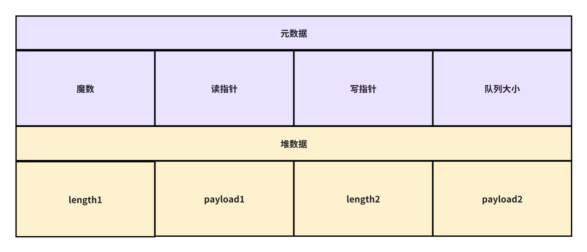
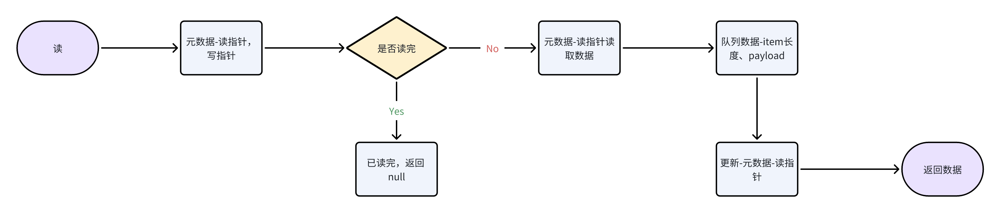
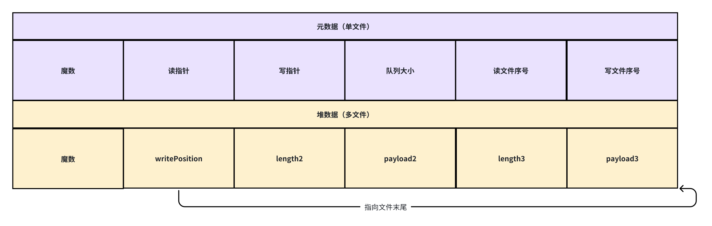
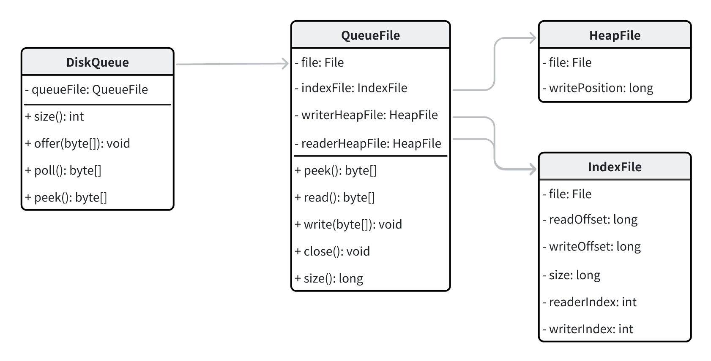
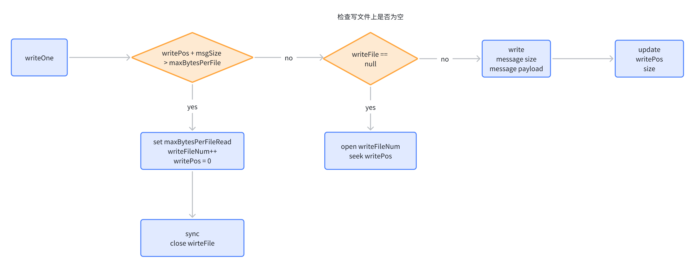

> 一步一步推导演进持久化磁盘队列的设计与实现。  
> 在方向不明确，不够熟练的情况下，从 demo 做起，一步步学习先进的设计理念并付诸行动。

---

## 第一版，单文件持久化队列

- 元数据、堆数据存储在一个文件中；
- 元数据：记录读、写消费指针，队列大小；
- 堆数据：item 长度、数据；
- 元数据 + 堆数据单文件存储；

UML 类图：

读：

写：

实现参考[dqv1](https://github.com/pedrogao/tinymq/tree/main/examples/dqv1)

---

## 第二版，多文件持久化队列

- 元数据、堆数据存储在不同文件中；
- 元数据：记录读、写消费指针，队列大小；
- 堆数据：item 长度、数据；
- 元数据 + 堆数据单文件存储；

实现参考[dqv2](https://github.com/pedrogao/tinymq/tree/main/examples/dqv2)

diskqueue：

- fields：
  - size：队列大小；
  - readPos：读偏移；
  - writePos：写偏移；
  - readFileNum：读文件序号；
  - writeFileNum：写文件序号；
  - nextReadPos：下一次读文件偏移；
  - nextReadFileNum：下一次读文件序号；
  - name：队列名称；
  - path：数据存储路径；
  - maxBytesPerFile：文件最大字节数；
  - maxBytesFileRead：文件最大可读字节数；
  - syncThreshold：刷盘次数阈值；
  - syncTimeout：刷盘间隔；
- methods：
  - open：（重新）打开队列；
  - readMetadata：读元数据；
  - writeMetadata：写元数据；
  - writeOne：写一条消息；
  - readOne：读一条消息；
  - sync：刷盘，元数据文件、写文件；

diskqueue open：

diskqueue readMetadata：

diskqueue writeMetadata：

diskqueue readOne：

readOne 需要同时支持 peek 和 poll，peek 不会更新 readPos、readFileNum、size，因此 readOne 也不会更新，但 poll 会更新。

diskqueue writeOne：

实现参考[dqv3](https://github.com/pedrogao/tinymq/tree/main/examples/dqv3)

优化点：

1. 刷盘策略：
1. 刷盘线程，频率可配置
1. 时间戳：
1. 按时间清除数据
1. Page 读取：
1. HeapFile、MetaFile 按照页组织
1. Cache 策略：
1. 增加读、写命中率

---

## 第三版，多消费者（Fanout）持久化队列

- 元数据、堆数据存储在不同文件中；
- 元数据：记录多个消费者读、写消费指针，队列大小；
- 堆数据：item 长度、数据；
- 元数据 + 堆数据单文件存储；

实现参考[diskqueue](https://github.com/pedrogao/tinymq/tree/main/diskqueue)
