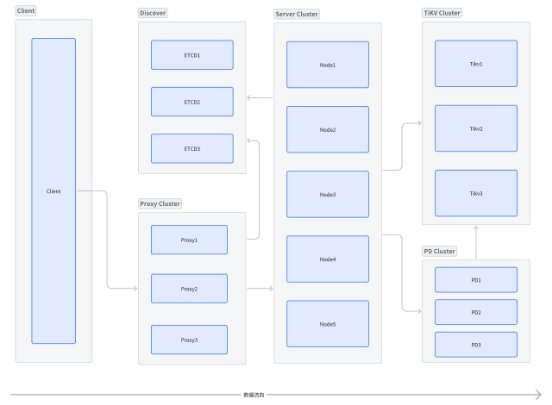
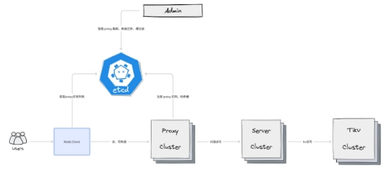
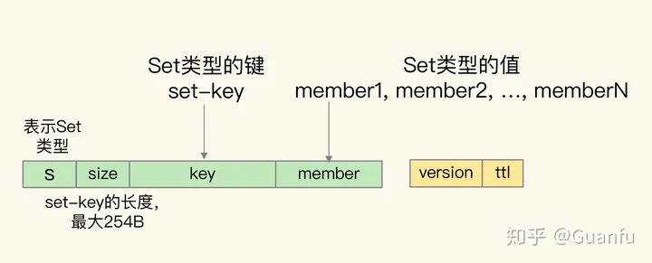
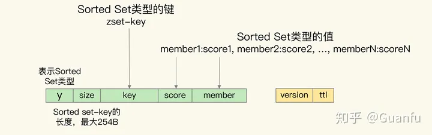

---
icon: edit
title: distributed-kv 设计与实现
date: 2023-09-20
tag:
  - kv
category:
  - distribute
  - kv
---

_旨在探索分布式缓存的设计与实现_

## 架构设计

### 目标

- 支持大容量缓存、持久化，PB 级别；
- 支持哈希槽分片，动态收缩；
- 支持 List，Set，String，Hash，Sorted set 等数据结构；
- 集成 Deno，支持脚本事务；
- 使用简单，redis-cli 客户端可直接使用，直连代理节点；
- 二次封装 redis 客户端，支持代理模式自动切换；

### 整体架构

distributed-kv 基于 Tikv 实现，并提供兼容 redis 数据结构的 API，支持基本 5 种基本类型数据结构，不支持 Pub/Sub，Pipeline 等高级特性，旨在探索超大容量缓存的架构实践。

整体如下：

- Client：客户端；
- Discover：服务发现；
- Proxy Cluster：服务代理集群；
- Server Cluster：缓存服务集群，按照哈希槽分片；
- Tikv Cluster：Tikv 集群，提供 KV 服务；
- PD Cluster：Tikv 调度器、元数据管理集群，与 Tikv 并存；

### 客户端

distributed-kv 提供两种客户端访问模式：

1. 原生 redis 客户端通过 proxy 地址访问；
2. 二次封装 redis 客户端通过 discover 服务发现访问；

原生客户端兼容已有 redis 客户端访问模式，但 proxy 服务宕机需要手动切换地址；二次封装客户端基于服务发现 proxy 集群，proxy 单点故障后，由服务发现通知更换，避免二次编码、配置更改发布。

### 代理服务

由于 distributed-kv 有多个缓存服务节点，这些节点可能分布在不同集群、区域中。客户端直接访问缓存服务有诸多不便：

1. 节点变更，客户端需感知变更；
2. 多集群访问需要多个不同连接池；
3. 缓存分片信息重度冗余在客户端等；

基于此，distributed-kv 加了一层代理服务，客户端无需过多关注缓存服务集群信息，只需直连代理服务就能访问到不同集群的数据，连接管理更加简单方便，降低客户端使用难度。

代理服务是多个 proxy 节点组成的集群，proxy 节点注册到 ETCD，客户端通过拉取和监听 proxy 列表，然后再向访问单节点 redis 一样访问每个 proxy 即可。

由于 proxy 集群部署，因此其中有节点宕机也并无关系，客户端会选择其它节点继续使用。

这样访问 distributed-kv 就跟访问普通 redis 一样了，其架构图如下：

### 缓存服务

缓存服务是 distributed-kv 的心脏，缓存集群负责处理 redis 协议请求，并将其转化为 Tikv 所支持的 KV API，操作 Tikv 集群后返回结果。

每个服务节点中 Transform 模块来负责完成 redis 5 种数据结构与基础 KV 的转换。

缓存服务通过哈希槽方式来实现分片，共有 1024 个哈希槽（slot），按照 crc32 哈希算法来分区，每个节点都有其特有的哈希槽，proxy 接到请求后，根据 key 的哈希计算得到 slot，然后转发到对应的缓存节点中。

### Tikv & PD

Tikv 是 Tidb 开源的一款分布式 KV 存储数据库，支持海量数据扩容，支持事务等多种特性，是 distributed-kv 的存储底座。

Tikv 本身架构就比较复杂，如下：

Tikv 具有优越的性能，良好的工程设计以及丰富的特性，十分适合作为分布式存储底座，这里就不赘述，可参考[这里](https://github.com/tikv/tikv)。

## 详细设计

下面就每个模块详细阐述其设计。

### 客户端

#### 原生客户端

指定 proxy 地址，直接使用 redis-cli 就可以直连，兼容 redis 生态，但：

- 不支持**除**5 种基本类型的数据结构；
- 不支持代理集群自动切换等高级功能，代理节点宕机需手动更改地址；

#### 代理客户端

兼容 redis 协议的新客户端，只需指定 Discover 服务发现组件的地址就能自动连接到 proxy 集群，支持：

- proxy 宕机自动切换；
- proxy 集群动态收缩；
- 读写分离；

### 代理服务

代理服务最大的特点是 IO 密集，主要有如下功能：

- 网络连接管理；
- 协议解析；
- 协议转发；
- 命令监控；

另外代理节点启动时，需要向 Discover 中注册自身地址，供客户端使用；节点宕机后，注册信息自动失效，代理节点开启后台线程定点检查注册信息是否存在和正确。

### 缓存服务

缓存服务主要有如下功能：

- 协议解析、数据处理；
- redis 命令转化为 Tikv API；

缓存服务也需要将自己地址、哈希槽位等信息注册到 Discover 中，proxy 转发时会根据信息转发到正确的缓存节点上。

Tikv 只提供了单值的键值对类型，而 redis 键值对中的值还可以是集合类型，Transform 模块就需要处理这二者之间的转换。

对于 redis 的 String 类型来说，它本身就是单值的键值对，我们直接用 Tikv 保存就行。但是，对于集合类型来说，就无法直接把集合保存为单值的键值对，而是需要进行转换操作。

为了保持和 Redis 的兼容性，Transform 模块就负责把 redis 的集合类型转换成单值的键值对。简单来说，可以把 Redis 的集合类型分成两类：

1. 一类是 List 和 Set 类型，它们的集合中也只有单值；
2. 另一类是 Hash 和 Sorted Set 类型，它们的集合中的元素是成对的，其中，Hash 集合元素是 field-value 类型，而 Sorted Set 集合元素是 member-score 类型。

具体怎么转换呢？下面分别看下每种类型的转换。

#### List 类型

List 集合的 key 被嵌入到了单值键值对的键当中，用 key 字段表示；而 List 集合的元素值，则被嵌入到单值键值对的值当中，用 value 字段表示。

因为 List 集合中的元素是有序的，所以，Transform 模块还在单值键值对的 key 后面增加了 sequence 字段，表示当前元素在 List 中的顺序，同时，还在 value 的前面增加了 previous sequence 和 next sequence 这两个字段，分别表示当前元素的前一个元素和后一个元素。

此外，在单值键值对的 key 前面，Transform 模块还增加了一个值“l”，表示当前数据是 List 类型，以及增加了一个 1 字节的 size 字段，表示 List 集合 key 的大小。

在单值键值对的 value 后面，Transform 模块还增加了 version 和 ttl 字段，分别表示当前数据的版本号和剩余存活时间（用来支持过期 key 功能），如下图所示：

#### Set 集合

Set 集合的 key 和元素 member 值，都被嵌入到了 Pika 单值键值对的键当中，分别用 key 和 member 字段表示。同时，和 List 集合类似，单值键值对的 key 前面有值“s”，用来表示数据是 Set 类型，同时还有 size 字段，用来表示 key 的大小。Pika 单值键值对的值只保存了数据的版本信息和剩余存活时间，如下图所示：

#### Hash 集合

对于 Hash 类型来说，Hash 集合的 key 被嵌入到单值键值对的键当中，用 key 字段表示，而 Hash 集合元素的 field 也被嵌入到单值键值对的键当中，紧接着 key 字段，用 field 字段表示。Hash 集合元素的 value 则是嵌入到单值键值对的值当中，并且也带有版本信息和剩余存活时间，如下图所示：

#### Sorted Set 类型

Sorted Set 类型需要能够按照集合元素的 score 值排序的，而 RocksDB 只支持按照单值键值对的键来排序。所以，Nemo 模块在转换数据时，就把 Sorted Set 集合 key、元素的 score 和 member 值都嵌入到了单值键值对的键当中，此时，单值键值对中的值只保存了数据的版本信息和剩余存活时间，如下图所示：

采用了上面的转换方式之后，Transform 不仅能兼容支持 Redis 的数据类型，而且还保留了这些数据类型的特征，例如 List 的元素保序、Sorted Set 的元素按 score 排序。

_Transform 转换方案并不是自己独有的，而是参考了 Pika，包括 rockskv 也使用了类似方案。_

## What's Next

实现 distributed-kv 😂，然后再完善文档。

## 参考资料

- https://github.com/pedrogao/rust-kv
- [用 Golang 实现 Redis - 随笔分类 - -Finley- - 博客园](https://www.cnblogs.com/Finley/category/1598973.html)
- https://github.com/seppo0010/rsedis
- https://github.com/erikgrinaker/toydb
- [6.5840 Lab 4: Sharded Key/Value Service](https://pdos.csail.mit.edu/6.824/labs/lab-shard.html)
- https://github.com/lotusdblabs/lotusdb
- https://github.com/tidb-incubator/tidis
- https://github.com/yongman/tidis
- https://github.com/ledisdb/xcodis
- https://github.com/dgraph-io/badger
- https://github.com/talent-plan/tinykv
- https://github.com/etcd-io/raft
- https://github.com/HDT3213/godis
- [实践篇（08）Pika: 如何基于 SSD 实现大容量 Redis？](https://zhuanlan.zhihu.com/p/325745018)
- https://mp.weixin.qq.com/s/jsJ3\_E\_5IOs4\_rPDM5axzQ
- [TiKV 源码解析系列 - multi-raft 设计与实现](https://cn.pingcap.com/blog/the-design-and-implementation-of-multi-raft#raftstore)
- [开源|如何开发一个高性能的 redis cluster proxy? - 掘金](https://juejin.cn/post/6844904134550749191)
- [Redis Cluster 的数据分片机制 - 掘金](https://juejin.cn/post/6844903850529259528)
