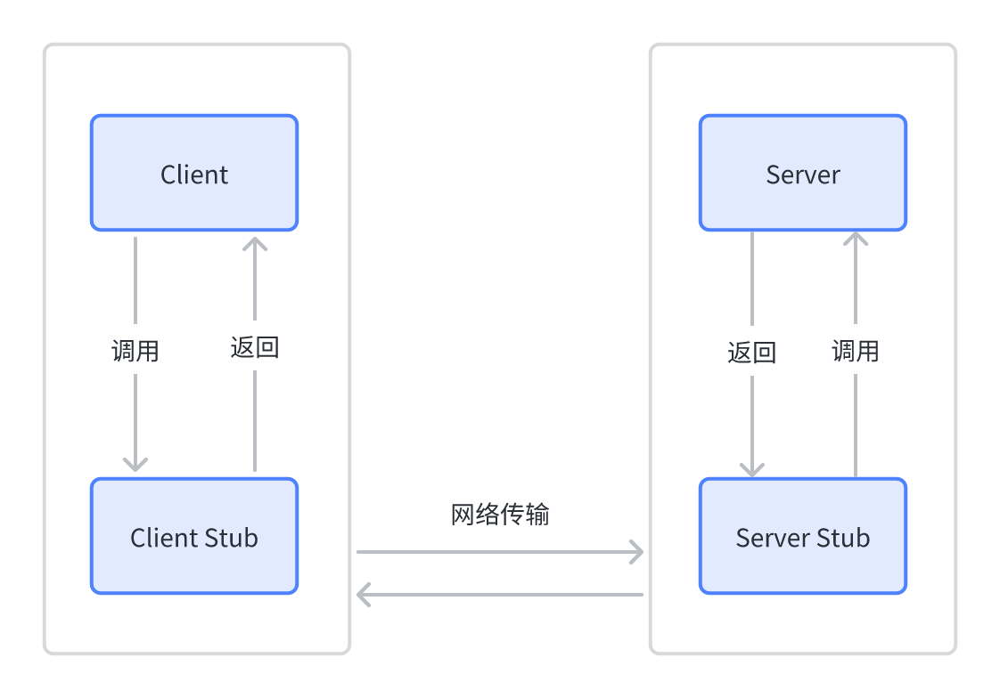
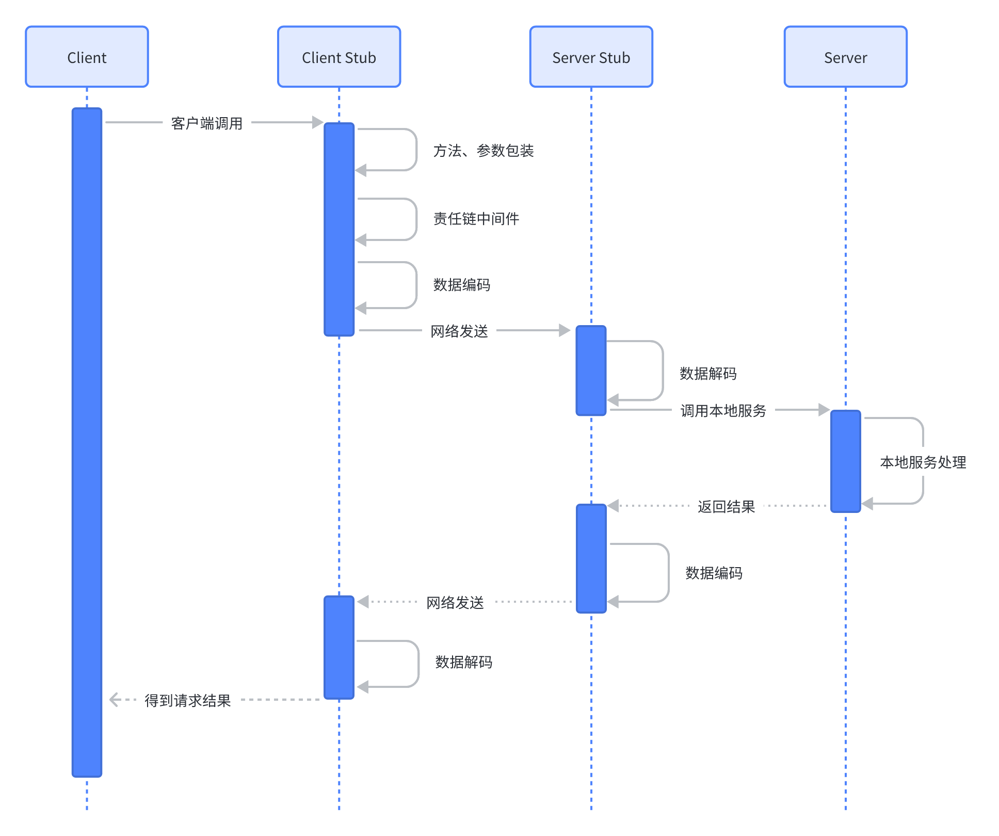
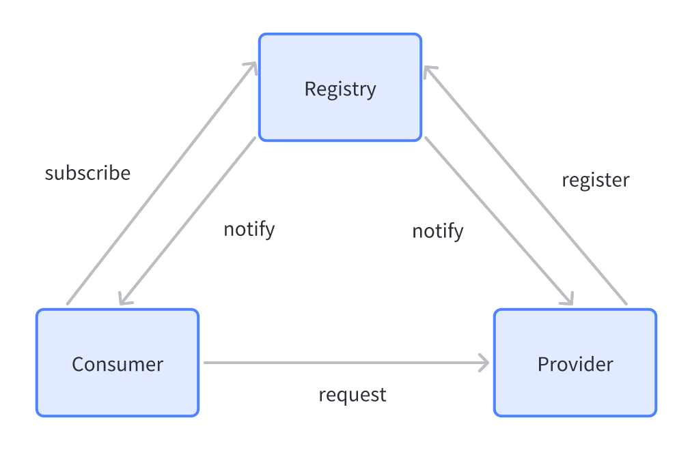
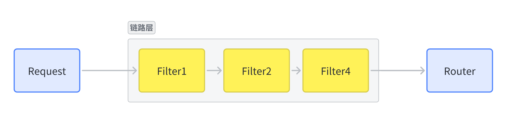

> 探索一个简单、易用RPC框架——tinyrpc的设计与实现

## 整体设计

RPC（Remote Procedure Call），全称为远程调用。一个完整的RPC架构分为了以下几个核心组件：

- Server：服务器；
- Client：客户端；
- Server Stub：服务端接收到Client发送的数据之后进行消息解包，调用本地方法；
- Client Stub：将客户端请求的参数、服务名称、服务地址进行打包，统一发送给server方；



调用流程如下图所示：



## 详细设计


tinyrpc 框架的整体结构基本分层为：

- 代理层：负责对底层调用细节的封装；
- 链路层：负责执行一些自定义的过滤链路，可以供后期二次扩展；
- 路由层：负责在集群目标服务中的调用筛选策略；
- 协议层：负责请求数据的转码封装等作用；
- 序列化层：负责将不同的序列化技术嵌套在框架中；
- 注册层：关注服务的上下线，以及一些权重，配置动态调整等功能；
- 容错层：当服务调用出现失败之后需要有容错层的兜底辅助；
- 接入层：考虑如何与常用框架Spring的接入。

### 代理层

代理层旨在帮助开发者包装RPC接口调用参数，屏蔽通信、序列化等调用细节。

开发者在服务端只需定义、实现接口：

```java
public interface DataService {
    String sendData(String data);

    List<String> getList();
}

public class DataServiceImpl implements DataService {
    @Override
    public String sendData(String data) {
        return "success";
    }

    @Override
    public List<String> getList() {
        return Arrays.asList("a", "b", "c");
    }
}
```

在客户端通过代理拿到接口并直接调用，即可完成整个RPC调用链路，极大地拉低了框架使用门槛。如下：

```java
final DataService dataService=ProxyFactory.get(DataService.class); // proxy service bean
for(int i=0;i< 100;i++){
    String response=dataService.sendData("Hello RPC");
    log.info("Client.main: response: {}",response);
}
```

Java中实现接口代理的方式有两种：

|   方案    | 优点                                                 | 缺点                                                                                                                   |
| :-------: | ---------------------------------------------------- | ---------------------------------------------------------------------------------------------------------------------- |
|  JDK代理  | JDK原生，上手简单，门槛低；                          | 不能对类进行代理，只能对接口进行代理，如果我们的类没有实现任何接口，那么就不能使用这种方式进行动态代理；调用性能较差； |
| Javassist | 动态字节码生成，接口、类都能代理，还能生成业务代码； | 字节码生成，调用性能高；字节码生成，开发门槛高；                                                                       |

### 路由层

如果一个服务有多个提供者，客户端需要从其中选择一个最合适的服务提供者并发起请求；服务选择是路由层的核心功能，为了更好的支持业务发展，也需要支持如下功能：

- 服务负载均衡；
- 服务权重选择；
- 服务轮训选择；
- 服务灰度策略等；

每个服务提供者都有一个唯一且确定的连接，路由层通过不同的策略来选择合适的连接，并发起请求：


基于此，我们抽象一个 Router 接口，用于客户端发起请求时选择提供者连接：

```java
public interface Router {
    ConnectionWrapper select(List<ConnectionWrapper> connectionWrappers);

    ConnectionWrapper select(List<ConnectionWrapper> connectionWrappers, String serviceName);
}
```

以哈希路由为例，具体实现如下：

```java
public class HashRouter implements Router {
    @Override
    public ConnectionWrapper select(List<ConnectionWrapper> connectionWrappers) {
        return select(connectionWrappers, "");
    }

    @Override
    public ConnectionWrapper select(List<ConnectionWrapper> connectionWrappers, String serviceName) {
        int hashCode = serviceName.hashCode();
        int i = hashCode % connectionWrappers.size();
        return connectionWrappers.get(i);
    }
}
```

虽然一个服务会存在多个提供者，但是只要提供的参数保持不变，哈希后选择的提供者也不会变。其它的路由实现就不赘述了。

### 协议层

协议是RPC的灵魂，需要考虑如下因素：

- 性能，协议传输效率，降低延迟；
- 兼容，协议版本升、降级，向前、后兼容；
- 存储，协议包尽可能小，提升带宽利用率；
- 可读，协议可读性好，方便调试、观测；

良好的协议需要充分的调研和长时间的打磨，但我们显然没有这种条件，这里我们提出了一种名为 TinyProtocol 的简单协议：


TinyProtocol 小巧可用，仅有5个字段，性能高：

- Magic：魔数，判断消息是否有效；
- Version：协议版本；
- Serialization：content 序列化方法；
- Length：content 长度；
- Content：请求内容；

在Netty的加持下，协议编解码实现就非常简单了，首先是编码：

```java
public class TinyEncoder extends MessageToByteEncoder<TinyProtocol> {
    @Override
    protected void encode(ChannelHandlerContext channelHandlerContext,
                          TinyProtocol tinyProtocol, ByteBuf out) throws Exception {
        out.writeShort(tinyProtocol.getMagicNumber());
        out.writeShort(tinyProtocol.getVersion());
        out.writeShort(tinyProtocol.getSerialization());
        out.writeInt(tinyProtocol.getContentLength());
        out.writeBytes(tinyProtocol.getContent());
    }
}
```

编码部分十分简单，直接向ByteBuf中写入5个字段即可，性能十分可观；另外解码部分也十分简单：

```java
public class TinyDecoder extends ByteToMessageDecoder {
    public final int BASE_LENGTH = 2 + 2 + 2 + 4;

    @Override
    protected void decode(ChannelHandlerContext ctx, ByteBuf byteBuf, List<Object> out) throws Exception {
        // magicNumber + contentLength
        if (byteBuf.readableBytes() < BASE_LENGTH) {
            return;
        }
        short magicNumber = byteBuf.readShort();
        if (magicNumber != MAGIC_NUMBER) {
            byteBuf.resetReaderIndex(); // magic number invalid, reset reader index
            return;
        }
        short version = byteBuf.readShort(); // protocol version
        short serialization = byteBuf.readShort(); // serialization type
        int length = byteBuf.readInt();
        if (byteBuf.readableBytes() < length) {
            byteBuf.resetReaderIndex(); // content length invalid, reset reader index
            return;
        }
        byte[] content = new byte[length];
        byteBuf.readBytes(content);
        TinyProtocol tinyProtocol = new TinyProtocol(version, serialization, content);
        out.add(tinyProtocol);
    }
}
```

由于继承了 ByteToMessageDecoder，消息拆包、粘包已被默认处理。

### 序列化层

序列化层核心功能是将业务数据序列化为二进制数据，然后交给网络层进行传输，在整个调研链路中，序列化十分频繁，是提升整体性能的一个关键点。

目前序列化成熟方案有很多，大致可分为两类：

- 二进制协议，比如知名的 protobuf，thrift等；
- 文本协议，比如 json，xml 等；

|    方案    | 优点                               | 缺点                     |
| :--------: | ---------------------------------- | ------------------------ |
| 二进制协议 | 无冗余字段，传输高效，方便解析     | 观测性差，调试困难       |
|  文本协议  | 直观、描述性强，容易理解，便于调试 | 冗余数据较多，占用空间大 |

tinyrpc 抽象了 Serializer 接口用于调用参数序列化抽象：

```java
  public interface Serializer {
    <T> byte[] serialize(T obj);

    <T> T deserialize(byte[] data, Class<T> clz);
}
```

通信时，按照 TinyProtocol 中的 serialization 字段来选择序列化框架，默认我们使用 json 序列化，框架选择
fastjson（实在是国内用的太普遍了）：

```java
 public class JsonSerializer implements Serializer {
    @Override
    public <T> byte[] serialize(T obj) {
        return JSON.toJSONBytes(obj);
    }

    @Override
    public <T> T deserialize(byte[] data, Class<T> clz) {
        return JSON.parseObject(data, clz);
    }
}
```

### 注册层

服务消费者通过注册中心感知服务提供者的地址信息，从而发起RPC请求；如下：



- 服务提供者向注册中心注册服务；
- 服务消费者从注册中心订阅服务；
- 消费者拿到服务URL后，向提供者发起请求；
- 当注册数据发生变更时，向提供者、消费者发送变更通知；

以Zookeeper为例，服务注册遵循目录规范，一个简单的服务注册结构图如下：


服务提供者：向ZK注册（register）地址信息，启动RPC服务，等待请求；
服务消费者：向ZK订阅（subscribe）地址信息，发起RPC请求，等待响应；

考虑到服务提供者会发生下线、宕机、发布，因此注册的地址信息存在变更、失效等场景；因此消费者订阅后，需要通过其它手段来及时同步地址信息：

1. 重新订阅：RPC请求失败后，重新请求ZK获取地址信息；
2. ZK通知：订阅时，附带订阅地址信息变更通知（ZK通知只有一次，每次通知后需重新订阅通知）；
3. 定时刷新：启动定时任务，固定时段去重新获取地址信息；

### 链路层

扩展性是一个RPC框架另一个重要的特性，RPC框架在设计时就应该考虑到将框架部分模块功能暴露出去；责任链模式非常适合帮助框架提高扩展性。



代理层封装方法、参数后，将请求交给路由层之前必须经过整个链路层（责任链）后才能到达路由层，而在整个责任链路中，都支持插入用户自定义的中间件对请求处理，比如：

- 打印RPC调用日志；
- 修改RPC调用参数；
- 等等；

> 链路层不仅仅可以在代理层、路由层之间，还可以在其它地方也引入责任链，这里就不赘述了。

tinyrpc 支持客户端、服务端（未实现）双端过滤器责任链：

```java
  public interface ClientFilter extends Filter {
    boolean handle(Invocation invocation);
}
```

有了过滤器后，打印调用日志就十分简单了：

```java
  public class LogFilter implements ClientFilter {
    private final Logger log = LoggerFactory.getLogger(LogFilter.class);

    @Override
    public boolean handle(Invocation invocation) {
        log.info("call {} {}", invocation.getTargetServiceName(), invocation.getTargetMethod());
        return true;
    }
}
```

### 容错层

容错层主要处理如下一些异常情况：

- 网络层，RPC 请求时，网络通信失败处理；
- 路由层，获取提供者信息失败；
- 序列化层，数据序列化失败；
- 链路层，自定义业务处理失败；
- 服务过载保护机制，限流、降级、熔断；

整个框架的每个模块都有调用错误、失败的可能，提升整个框架稳定性是容错层必须解决的问题。

提升容错，我们主要考虑下面两个核心思想：

1. 快速报错，将错误信息上升到业务逻辑；
2. 延时重试，屏蔽底层通信、序列化可能带来的异常；
3. 服务提供者新增限流、降级、熔断机制；

以重试为例，如果服务提供者正在发布，或者突然宕机，那么客户端此时的请求很可能会失败，tinyrpc 需要 cover 这种情况，
因此会尝试不断重试，直到重试次数超过了阈值，才会将错误信息上报到调用方：

```java
private final Retryer<Object> retryer=RetryerBuilder.newBuilder()
        .retryIfResult(Objects::isNull)
        .retryIfRuntimeException()
        .withWaitStrategy(WaitStrategies.fixedWait(1L,TimeUnit.SECONDS))
        .withStopStrategy(StopStrategies.stopAfterAttempt(5))
        .build();


        Callable<Object> callable = () -> {
            SEND_QUEUE.add(invocation);
            Object result=RESP_MAP.get(invocation.getUuid());
            if(result instanceof Invocation){
                return((Invocation)result).getResponse();
            }
            return null;
        };

        try {
            return retryer.call(callable);
        } catch (RetryException|ExecutionException e) {
            log.error("JDKClientInvocationHandler.invoke error ",e);
            throw new RuntimeException(e);
        }
```

容错是一个系统稳定的根本，需要大量实践和打磨，也是工程师素养的重中之重。

## 下一步计划

tinyrpc 是一个可用的RCP玩具，旨在学习和实践，距离生产可用还有很长的距离。

tinyrpc 可优化的 3 个方向：

1. 提升性能，优化序列化、代理、worker线程池（Netty处理器中不阻塞流程）、锁优化等；
2. 新增SPI插件，提升扩展性；
3. 新增注册、订阅事件、回调，提升业务开发效率；
4. 接入spring，tinyrpc 实现后，我们可以通过接入spring来进一步拉低使用门槛，并融入spring的庞大生态；

以SPI插件为例，我们可以参考 mysql-connector-driver 的实现，将驱动实现交给其它方；tinyrpc 也可以将序列化、路由负载均衡交给其它方，然后在框架启动时，
扫描 meta-info 目录获取实现类并加载应用即可。
