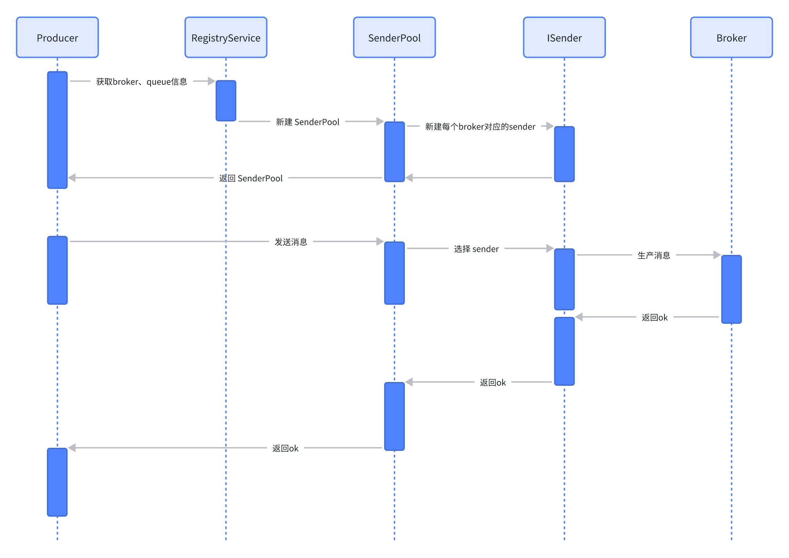

> 旨在探索 MQ 的设计与实现，掌握基本原型即可，不上升高级功能。

中间件三驾马车：数据库、缓存，MQ，是每个后端工程师都应深入理解的必备技能，同时也是工作、面试的常客。

自工作以来，笔者基本每天都在与消息队列（MQ）打交道，无论是模块解耦，流量削峰，还是事件通知，MQ 都太好用了。

彻底搞懂 MQ，这个目标一直都在，但苦于下面的原因所以一直没有实施：

1. 工作内容又繁又杂，没有一个整块时间去思考与沉淀；
2. MQ 选型众多，Kafka，RocketMQ，Pulsar 等都非常好用，但各有各的特点与不同；
3. MQ 经过这么多年的发展，本来也越来越复杂，一头扎进去难免一叶障目；

市面上的 MQ 产品，比如 Pulsar，Kafka，RocketMQ，经过多年的迭代，已经变得十分复杂和臃肿，不再适合作为一个原型产品进行学习与实践。本着实现了才算理解的初衷，笔者尝试去设计与实现一个极简 MQ，称为 tinymq。

## 架构设计

tinymq 架构着重参考了 Kafka（没办法，Pulsar、RocketMQ 都参考了它）， 在一些方面做了精简：


- 整体上，仍然沿用 Producer、Broker、Consumer 的数据流设计；
- 注册中心选用 Zookeeper，实现上可以抽象为注册接口，方便后续迁移；
- 通信上，直接集成了 grpc 作为通信框架，无需自定义协议、序列化；
- 消息分区在 Producer 端实现，Broker 地址从注册中心获取；
- 不支持消费者组，一个 Topic 可以有多个消费者（Channel），每个消费者独有自己的消费序号；
- 消费进度没有存储至 ZK 中，而是直接在 DiskQueue 中存储；

## 详细设计

下面就每个模块，详细阐述其设计与实现。

### 元数据

tinymq 主要有如下几类元数据：

- broker 注册信息，那些 broker 在线，broker 地址、端口等，broker 下线则自动删除；
- topic 注册信息，创建了那些 topic，topic 下有那些分区（Queue），分区下消费者等；


元数据必须保证强一致性，高可靠，主流的注册中心有 Zookeeper、ETCD，Consul 等，这里和 Kafka 保持一致选择 ZK，ZK 的树结构十分适合 tinymq 注册数据。

实现上，为了方便后续扩展，tinymq 定义了 RegistryService：

```java
public interface RegistryService extends Closeable {
  void registerBroker(String brokerId, BrokerInfo brokerInfo);
  void unRegisterBroker(String brokerId);
  BrokerInfo getBroker(String brokerId);
  List<BrokerInfo> getAllBrokers();
  void registerTopic(String topicId, TopicInfo topicInfo);
  void unRegisterTopic(String topicId);
  TopicInfo getTopic(String topicId);
  List<TopicInfo> getAllTopics();
  void registerQueue(String topicId, String queueId, QueueInfo queueInfo);
  void unRegisterQueue(String topicId, String queueId);
  QueueInfo getQueue(String topicId, String queueId);
  void setQueueConsumer(String topicId, String queueId, String consumerId);
  String getQueueConsumer(String topicId, String queueId);
  void unsetQueueConsumer(String topicId, String queueId);
  List<QueueInfo> getQueuesByTopic(String topicId);
  List<QueueInfo> getAllQueues();
}
```

默认实现了 ZookeeperRegistryService，如果以后弃用 ZK，可以更换 RegistryService 实现。

在架构上，RegistryService 是多端访问元数据的桥梁，因此整个 ZK 集群的稳定性至关重要。

### Broker

broker 是 MQ 的心脏，承担着消息存储、转发、处理等核心功能，对外暴露主题操作、消息生产消费等核心 API。

#### API

broker 对外暴露的 API 分为两大类：

- 主题、队列类：操作 Topic，查询 Queue 信息；
- 消息：生产、消费消息；

tinymq 网络层直接由 protobuf 实现，API 定义如下：

```proto
service QueueService {
  rpc produceMessage (ProduceMessageRequest) returns (ProduceMessageResponse) {}
  rpc asyncProduceMessage (ProduceMessageRequest) returns(Empty) {}
  rpc consumeMessage (ConsumeMessageRequest) returns (ConsumeMessageResponse) {}
  rpc fetchMessage (FetchMessageRequest) returns (FetchMessageResponse) {}

  rpc createQueue(CreateQueueRequest) returns (CreateQueueResponse) {}
  rpc deleteQueue(DeleteQueueRequest) returns (DeleteQueueResponse) {}
  rpc getQueueSize(GetQueueSizeRequest) returns (GetQueueSizeResponse) {}
}
```

> 为什么选择 grpc？
> 主流的 MQ 框架都会自定义通信层、序列化层，这样就能保证消息链路全可控，方便迭代和优化，但同时也带来了麻烦，作为一个 MQ 原型，实在是不应该把精力花在通信层上面，因此已有成熟稳定的实现，拿来用是最好的选择。
> 暴露的消息 API 可以由生产者、消费者访问，主题操作 API 由 admin 平台访问。

有了 grpc 支持后，tinymq 只需实现 QueueService 服务即可，而这个接口由 QueueManager 来实现：

```java
public class QueueManager extends QueueServiceGrpc.QueueServiceImplBase implements Closeable {
//...
@Override
public void produceMessage(ProduceMessageRequest request, StreamObserver<ProduceMessageResponse> responseObserver) {
String queueName = request.getQueueName();
ByteString payload = request.getPayload();

    try {
        BackendQueue queue = queueMap.get(queueName);
        if (queue == null) {
            log.error("queue {} not found", queueName);
            Result result = genQueueNotFoundResult(queueName);
            ProduceMessageResponse response = ProduceMessageResponse.newBuilder().setResult(result).build();
            responseObserver.onNext(response);
            return;
        }

        long index = queue.push(payload.toByteArray());
        ProduceMessageResponse response = ProduceMessageResponse.newBuilder().setResult(genSuccessResult()).setIndex(index).build();
        responseObserver.onNext(response);
    } catch (Exception e) {
        log.error("produce message error", e);
        responseObserver.onError(e);
    } finally {
        responseObserver.onCompleted();
    }

}
// ...
}
```

QueueManager 负责管理当前 broker 下的所有 Queue 实例，主要功能包括：

- 消息入队、出队；
- 消息定时持久化；
- 旧消息清理等；

#### 消息存储

Topic 是 tinymq 的逻辑消息组织单位，为了支持分区，一个 Topic 下可以有多个 Queue：


每个 Queue 分配在不同的 broker 实例中。

Topic 分区分配、管理比较复杂，不同的 MQ 产品的实现都有所不同，tinymq 实现颇为简单粗暴，即每个 broker 一个 queue 实例。

队列消息存储又是一个大麻烦，可参考 diskqueue 持久化队列设计演进，这里不再赘述。为了支持多存储引擎，方便后续扩展和迭代，tinymq 定义了 BackendQueue 接口：

```java
public interface BackendQueue extends Closeable {
  String getName();
  long push(byte[] data) throws IOException;
  byte[] poll(String channel) throws IOException;
  byte[] peek(String channel) throws IOException;
  byte[] get(long index) throws IOException;
  boolean isEmpty(String channel) throws IOException;
  long size(String channel) throws IOException;
  void flush() throws IOException;
  void close() throws IOException;
  void delete() throws IOException;
  void removeBefore(long timestamp) throws IOException; // 删除旧数据
}
```

默认由 [diskqueue](https://github.com/pedrogao/tinymq/tree/main/diskqueue) 实现。

### 生产者

生产消息，并调用 API 将消息存储到 Broker；常见的消息生产方式有两种：

1. 同步生产，适合低频率消息生产，保证消息投递可靠性；
2. 异步生产，适合高频率消息生产，为了性能牺牲可靠性；

以同步生产为例，其流程图：



1. Producer 从 RegistryService 获取 broker、queue 注册信息；
2. 新建 SenderPool 实例，每个 broker 都对应一个 Sender，Producer 可以向多个 broker 发送消息，因此是 SenderPool；
3. Sender 将消息发送到 broker，并返回成功；

> 关于异步生产暂未实现，其核心是引入生产线程，并在成功后回调。

### 消费者

调用 API 消费消息，消费者实现方式一般有两种：

1. 拉模式，消费者主动从 broker 拉取消息；
2. 推模式，broker 主动向消费者推消息；

二者各有优劣，tinymq 选择实现拉模式，其流程图如下：


1. Consumer 从 RegistryService 中获取 broker、queue 信息；
2. 新建 MessageStream 用于返回 topic 下的消息流，Consumer 可以从多个 broker 中请求消息，每个 broker 一个 fetcher；
3. 消费消息，选择 fecther 获取其对应 broker 中的消息，并返回消息列表；

## 其它待实现特性

作为一个 MQ 原型，tinymq 实现了核心功能和 API，但距离真正可用还有很远的距离，比如缺少如下特性：

- 监控、告警；
- 副本；
- 延时队列；
- 死信队列；
- 消费者组；
- so on...；

参考资料

- [GitHub - pedrogao/tinymq: tiny distribute message queue implement & practice](https://github.com/pedrogao/tinymq)
