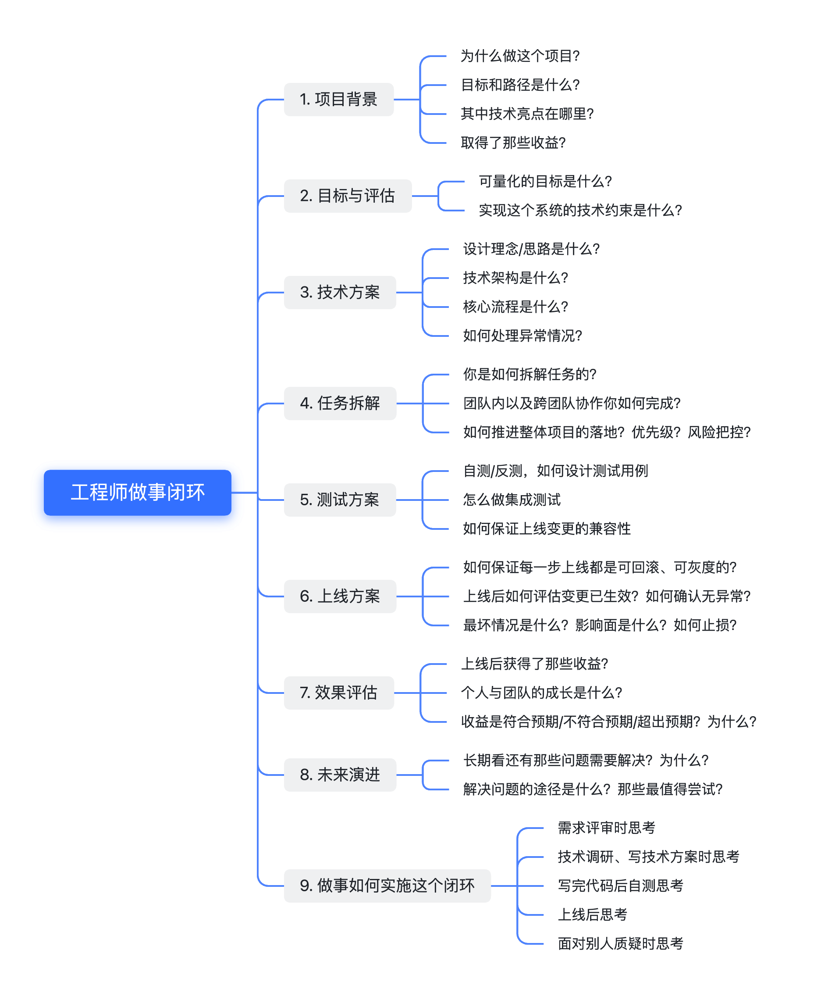

> 关注核心竞争力，用思考找到技术价值再动手做事，而非关注代码/项目本身

1. 项目背景
  - 为什么做这个项目？
  - 目标和路径是什么？
  - 其中技术亮点在哪里？
  - 取得了那些收益？
2. 目标与评估
  - 可量化的目标是什么？
  - 实现这个系统的技术约束是什么？
3. 技术方案
  - 设计理念/思路是什么？
  - 技术架构是什么？
  - 核心流程是什么？
  - 如何处理异常情况？
4. 任务拆解
  - 你是如何拆解任务的？
  - 团队内以及跨团队协作你如何完成？
  - 如何推进整体项目的落地？优先级？风险把控？
5. 测试方案
  - 自测/反测，如何设计测试用例
  - 怎么做集成测试
  - 如何保证上线变更的兼容性
6. 上线方案
  - 如何保证每一步上线都是可回滚、可灰度的？
  - 上线后如何评估变更已生效？如何确认无异常？
  - 最坏情况是什么？影响面是什么？如何止损？
7. 效果评估
  - 上线后获得了那些收益？
  - 个人与团队的成长是什么？
  - 收益是符合预期/不符合预期/超出预期？为什么？
8. 未来演进
  - 长期看还有那些问题需要解决？为什么？
  - 解决问题的途径是什么？那些最值得尝试？
9. 做事如何实施这个闭环
  - 需求评审时思考
  - 技术调研、写技术方案时思考
  - 写完代码后自测思考
  - 面对别人质疑时思考
  - 上线后思考

