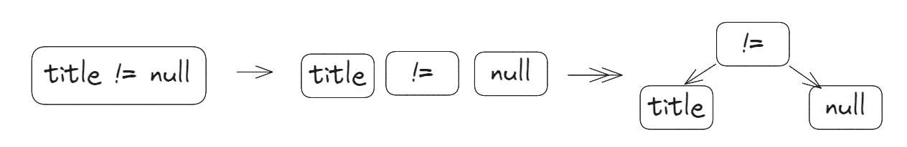

## 前言

之前有幸学习过徐昊的 [TDD](./tdd1.md) 课程，收获颇大，但是一直没有好的 idea 去实践，这次就用 TDD 的模式来实现一个简单的 Mybatis，取名为 TinyBatis。

## TDD 流程

> 以下仅为个人理解，一千个读者就有一千个哈姆雷特，欢迎大家探讨。

[TDD(Test-Driven Development)](https://en.wikipedia.org/wiki/Test-driven_development)核心是一套指导思想。

之前笔者编程的模式一直是：**先写代码，后写测试**。

这样编程会带来几个很麻烦的问题：

1. 代码写完后，测试用例写起来很麻烦，因为代码的设计并没有考虑到测试用例，所以测试用例写起来很费劲。
2. 严重依赖模块、代码结构设计，写起来很容易卡壳。
3. 误导排期和进度，代码写完了不代表功能完成了。

而 TDD 的核心思想是：**先写测试，后写代码**：

1. 编写测试用例，测试用例是对功能的需求的描述，有助于理解需求（需求都没理解，怎么可能写好代码）；
2. 测试用例反推代码结构，有利于写出测试良好的代码；
3. 重构方便，完备的测试用例保证了重构后代码的正确性；

有了 TDD 思想指导后，笔者的流程是这样的：

1. 理解需求，先写入口测试用例；
2. 从入口测试用例反推代码结构，写出测试良好的代码；
3. 通过测试用例；
4. 发现不合理代码，重构再通过测试用例；

## 需求

TinyBatis 的需求是这样的：

支持从`XML`配置构建`SqlSessionFactory`，`SqlSessionFactory`可以创建`SqlSession`，`SqlSession`可以执行`Mapper`中的`select`语句。

> TDD 真的不好用文字描述，本文写的稀烂，勉强能看，权当做个人 TDD 笔记吧。
> 代码直接参考[这里](https://github.com/pedrogao/wheels/tree/main/tdd/batis)。

## 测试用例

这样的一句话需求肯定是让人难受的（PM 经常这样干）。


拆解一下需求，将其转化为测试用例：

```java
  @Test
  public void testWithXml1() throws Exception {
      String resource = "mybatis-config.xml";
      InputStream inputStream = ResourceUtil.getResourceAsStream(resource);
      SqlSessionFactory sqlSessionFactory = new SqlSessionFactoryBuilder().build(inputStream);
  }
```

1. 读取`mybatis-config.xml`配置文件；

```xml
<?xml version="1.0" encoding="UTF-8" ?>
<!DOCTYPE configuration
        PUBLIC "-//mybatis.org//DTD Config 3.0//EN"
        "https://mybatis.org/dtd/mybatis-3-config.dtd">
<configuration>
    <environments default="development">
        <environment id="development">
            <transactionManager type="JDBC"/>
            <dataSource type="POOLED">
                <property name="driver" value="org.h2.Driver"/>
                <property name="url" value="jdbc:h2:mem:demo;INIT=runscript from 'classpath:create.sql'"/>
                <property name="username" value="sa"/>
                <property name="password" value=""/>
            </dataSource>
        </environment>
    </environments>
    <mappers>
        <mapper resource="BlogMapper.xml"/>
    </mappers>
</configuration>
```

2. 新建`SqlSessionFactoryBuilder`解析配置文件，构建`SqlSessionFactory`；

下面让这个测试用例通过：

新建`SqlSessionFactoryBuilder`类，新建`build`方法：

```java
public class SqlSessionFactoryBuilder {
    public SqlSessionFactory build(InputStream inputStream) {
        return new SqlSessionFactory(configurationConfig);
    }
}
```

新建`SqlSessionFactory`类：

```java
public class SqlSessionFactory {

    public SqlSessionFactory() {
    }

    public SqlSession openSession() {
      return new SqlSession();
    }
}
```

最后新建`SqlSession`类：

```java
public class SqlSession implements AutoCloseable {
    public SqlSession() {
    }
}
```

运行测试，测试通过。

## 渐进式开发

### 读取 XML 配置文件

第一个测试用例通过了，接下来就是实现第一个小需求：读取`mybatis-config.xml`配置文件。

```java
public class SqlSessionFactoryBuilder {
    public SqlSessionFactory build(InputStream inputStream) {
        ConfigParser configParser = new ConfigParser();
        try {
            ConfigurationConfig configurationConfig = configParser.parse(inputStream);
            return new SqlSessionFactory(configurationConfig);
        } catch (DocumentException e) {
            throw new RuntimeException("parse mybatis-config.xml error", e);
        } catch (ClassNotFoundException e) {
            throw new RuntimeException("load driver error", e);
        }
    }
}
```

新建`ConfigParser`类，实现`parse`方法：

```java
public class ConfigParser {
    public ConfigurationConfig parse(InputStream is) throws DocumentException {
        SAXReader saxReader = new SAXReader();
        Document document = saxReader.read(is);

        Element configurationElement = document.getRootElement();
        if (!configurationElement.getName().equals("configuration")) {
            throw new RuntimeException("root should be <configuration>");
        }

        Element environmentsElement = configurationElement.element("environments");
        String defaultEnvironment = environmentsElement.attribute("default").getValue();
        List<EnvironmentConfig> environmentConfigs = parseEnvironments(environmentsElement);
        Element mappersElement = configurationElement.element("mappers");
        List<MapperConfig> mapperConfigs = parseMappers(mappersElement);
        List<MapperNode> mapperNodes = new ArrayList<>(mapperConfigs.size());
        // Parse Mapper XML files
        MapperParser mapperParser = new MapperParser();
        for (MapperConfig mapperConfig : mapperConfigs) {
            InputStream mapperConfigInputStream = ResourceUtil.getResourceAsStream(mapperConfig.getResource());
            MapperNode mapperNode = mapperParser.parse(mapperConfigInputStream);
            mapperNodes.add(mapperNode);
        }

        return new ConfigurationConfig(defaultEnvironment, environmentConfigs, mapperConfigs, mapperNodes);
    }
    // ...
}
```

### 读取 Mapper XML 文件

```java
public class MapperParser {
    public MapperNode parse(InputStream is) throws DocumentException {
        SAXReader saxReader = new SAXReader();
        Document document = saxReader.read(is);

        Element mapperElement = document.getRootElement();
        if (!mapperElement.getName().equals("mapper")) {
            throw new RuntimeException("root should be <mapper>");
        }

        // ...
        return new MapperNode(namespace, selectNodes);
    }
}
```

### 支持`if`语句

```xml
  <select id="selectOne" resultType="github.io.pedrogao.tinybatis.Blog">
      select * from blog where id = ?
      <if test="title != null">
          and title = ?
      </if>
  </select>
```



`IfNode`类中解析`test`语句，并得到 tokens：

```java
public class IfNode {
    private String test;
    private String subSql;

    private List<Token> tokens;

    public IfNode(String test, String subSql) {
        this.test = test;
        this.subSql = subSql;
        this.tokens = new Lexer(test, Rule.DEFAULT_RULES).tokenize();
    }
    // ...
}
```

解析完成后在`SqlSession`中解释执行：

```java
  public Object selectOne(String id, Map<String, Object> variables, Object... params) {
      try {
          SelectNode selectNode = selectNodeMap.get(id);
          if (selectNode == null) {
              throw new RuntimeException("selectNode not found");
          }

          StringBuilder sql = new StringBuilder(selectNode.getSql());
          for (var ifNode : selectNode.getIfNodes()) {
              String subSql = ifNode.getSubSql();
              Parser parser = new Parser(ifNode.getTokens());
              Expr expr = parser.parseExpr(); // 1. 解析得到表达式
              Object res = interpreter.interpret(expr, variables); // 2. 执行表达式
              if (res != null && (Boolean) res) { // 3. 如果结果为 true，拼接 subSql
                  sql.append(" ").append(subSql);
              }
          }

          PreparedStatement statement = connection.prepareStatement(sql.toString());
      }
  }
```

## 参考资料

- [Generating java code from xml schema](https://www.jetbrains.com/help/idea/generating-java-code-from-xml-schema.html#jaxb)
- [Test-driven development](https://en.wikipedia.org/wiki/Test-driven_development)
