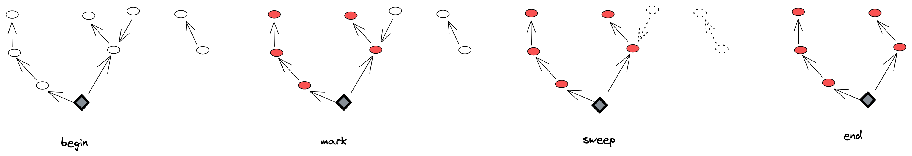
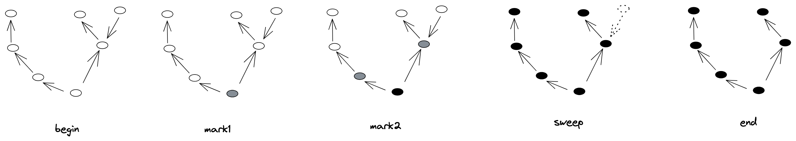

# Go 内存管理设计与实现

## 概述

在[冯·诺伊曼](https://zh.wikipedia.org/wiki/%E5%86%AF%C2%B7%E8%AF%BA%E4%BC%8A%E6%9B%BC%E7%BB%93%E6%9E%84)的设计理念的指导下，计算机将**计算**与**存储**这个两大核心模块进行分离，二者通过**总线**连接，协调工作：


对于计算而言，CPU 无疑是核心（CPU 内部结构无需过多关注），但对于存储而言，则要麻烦的多。

带来这个麻烦的主要因素在于：CPU 与存储设备之间巨大的速度差异。

以 CPU 的指令周期为单位，如果数据在高速缓存中，那么 CPU 访问到数据只需 4 ～ 75 个周期，如果在内存中，则需要上百个周期，而如果在磁盘中，那么就需要几千万个周期。

存储设备类型的不同也会带来存储性能巨大的差异，比如 SRAM（Static Random-Access Memory）存储设备性能很高，被用来作为 CPU 的高速缓存，CPU 访问它们只需几个时钟周期，而 DRAM（Dynamic Random-Access Memory）被用做主存（内存），CPU 访问它们需要上百个周期；而磁盘存储被用来保存大量数据，磁盘读比 SRAM 慢了足足 100 万倍。

即使速度差距如此之大，计算机的主要存储设备仍然是 DRAM（内存）和磁盘（或者 SSD）。

这是因为，SRAM 虽然性能强劲，却也十分昂贵，CPU 旁边的高速缓存容量一般也就几百 KB，或者几 MB。它们之间的速度差异可以用[存储器山](https://zh.wikipedia.org/wiki/%E5%AD%98%E5%82%A8%E5%99%A8%E5%B1%B1)来直观的展示：


计算机往往是多种存储设备共存，相互协助让 CPU 充分发挥其性能。而内存（Main Memory，也称主存）作为山中最核心的一层，担任着**缓冲**与**加速**的重要工作，其重要性不言而喻。

也因此，**内存管理** 模块是操作系统、编程语言中极为重要且不可或缺的一部分。

> 操作系统对内存的抽象和管理是很复杂的，里面涉及到大量概念和机制  
> (比如虚拟内存、分页、权限、缺页中断等等)，不熟悉的同学  
> 可以点击[这里](https://zhuanlan.zhihu.com/p/152119007)回顾一下。
> 编程语言工作在操作系统之上，所管理的内存在进程地址空间上，因此笔者  
> 不会介绍地址空间之下的内容。

## 内存布局

对于一个程序而言，当其以进程的形式被创建时，操作系统会为其分配一片巨大的虚拟内存，被称为地址空间。如下：


如图所示，内存空间被划分为了多个区：

- 栈区(Stack)：存储执行期间的局部变量、参数等，从高地址向地址增长；
- 堆区(Heap)：动态内存分配区，也是内存管理的主战场；
- 数据区(BSS、Data)：数据区可以划分为两个部分，BSS 表示存储但未被初始化的全局变量和静态变量，而 Data 区表示已经初始化完毕的全局、静态变量；
- 代码区(Text)：存储只读的机器指令。

按照这些区各自的特点，代码区的指令会自动根据 PC 寄存器的值加载至 CPU 并运行，栈区用于保存局部变量、参数，内存会自动随着函数调用而开辟和释放，数据区的内存由于是全局、静态变量，因此也不会被释放调，它们在程序启动的时候就已经被分配了，在整个程序的生命周期中一直存在。

而剩下的**堆区**则是程序内存管理的最主要战场了，事实上堆内存也占据了地址空间上最大的一块。堆内存具有如下特点：

- 生命周期灵活，由用户程序自己管理；
- 大小可变，可按块分配大内存，也可按字节分配小内存；
- 按需分配，由 sbrk 指针管理，指针上移则开辟内存，下移则释放内存；

堆内存虽然灵活，但同时也带来了一些问题：

1. 如果开辟的内存未使用，但也未释放，就会造成内存泄漏；
2. 如果开辟的内存仍在使用，但被释放了，就会造成悬挂指针。

这些内存问题也一直困扰着 C/C++程序员们，尤其是初学者。

## 管理方式

既然内存管理如此重要，因此几乎所有编程语言都将内存管理内置到了语言中，而它们的管理方式可以分为两大类：

- 手动管理：如 C 中 malloc/free 函数分别用来开辟、释放内存；
- 自动管理：如 Java、Go、Python 等内置了垃圾回收器(GC)来追踪内存使用，自动释放未用的内存（垃圾）。

### 手动管理

手动内存管理应该算是内存管理的经典流派了，其核心思想是充分信任程序员，待程序需要更多内存时，通过 malloc(或者 new) 函数来开辟内存，当内存不再需要的时候，调用 free(或者 delete) 函数来释放。

理想情况下，一个高素质的工程师不仅能合理完成业务需求，还要对程序内存使用做到精准管理，这样内存不仅能够得到完善的管理，也不会造成内存安全问题。

C/C++ 是手动内存管理语言的代表，举个简单的例子：

```c
int main(int argc, char const *argv[])
{
   // 开辟内存
   int *a = (int *)malloc(sizeof(int));
   *a = 1;

   printf("%d\n", *a);

   // 用完后释放
   free(a);
   return 0;
}
// output:
// 1
```

在这个简单的 C 语言例子中，开发者必须手动调用 malloc 来为变量 `a` 分配内存，待使用完后，又需要手动调用 free 将内存还给进程。

试想一下，对于少量的变量，精准控制它们的分配与释放是较为简单的，可是一旦代码量急剧攀升，变量也极具攀升，而人的精力总是有限的，难免会出现错误导致内存问题。

而且很多时候，为了性能考虑，开发者还需抉择内存是在堆上分配，还是栈上分配，如此机械的开辟、释放工作无疑会占开发者很多的时间和精力。

C++为了改善一点，引入了构造、析构函数，智能指针（本质上是引用计数）来改善内存的自动管理，一些 C++的拥趸者觉得这已经够了，但更多的人觉得这不够，因此他们引入了纯自动内存管理的编程语言。

### 自动管理

自动内存管理几乎是现代语言的标准，第一个使用内存自动管理的语言是 [Lisp](<https://en.wikipedia.org/wiki/Lisp_(programming_language)>)，它的作者 John 为其实现了一个非常简单的 GC(Garbage Collection)算法，被称为标记清理算法(Mark-Sweep)。

这个算法管理内存的思路很简单：

1. 标记：实时追踪程序变量，标记出可达对象；
2. 清理：标记完成后，未标记的对象都是不可达的，可以作为垃圾清理掉。

这个算法思路虽然简单，但至今仍在使用，是学习 GC 算法的必经之路。当然 GC 算法还有很多，每个语言的实现不尽相同，后文我们再来细谈。

内存从手动管理到自动管理是语言的一大步，这种机制彻底解放了开发者们，并且让普通人开始着手写代码，体验创造的乐趣。此后，工程师只需将精力集中在核心的业务逻辑上，无疑这提升了开发效率。

但好东西都是有代价的，内存自动管理虽然帮助开发者节约了时间和精力，解决了基本的内存问题，但同时也带来了一定量的性能损害，这其中就有最臭名昭举的 STW(Stop The World)问题。

## 内存管理

在对内存、内存布局、内存管理简单介绍后，我们进入真正的正文部分：用 Go 来实现内存管理。

肯定很多人觉得 Go 是一门自带 GC 的语言，有必要再去管理其内存吗？

理论上来说，是不需要的，但最近一段时间笔者分别看到了三篇文章，它们不约而同地指向了一件事情：Go 的 GC 不稳定，我们需要另外的内存管理方式。

这三篇文章分别是：

1. 2019 年 Ross 在 twitch 上发表了一篇名为[Go memory ballast: How I learnt to stop worrying and love the heap](https://blog.twitch.tv/en/2019/04/10/go-memory-ballast-how-i-learnt-to-stop-worrying-and-love-the-heap/)的文章；Ross 提出了一种 ballast 的内存管理方式，显著地降低了 GC 带来的延时。

2. 2022 年 2 月，danscales 在 Go 的官方 Github 仓库上提出了一个名为[proposal: arena: new package providing memory arenas](https://github.com/golang/go/issues/51317)的提案，这个提案希望 Go 能提供一种手动内存管理的 Area API。

3. 同样在 2022 年 2 月，heiyeluren 在 Github 上开源了一个名为[XMM](https://github.com/heiyeluren/xmm)的 Go 三方内存管理库，旨在完美逃逸掉 Go 的内存 GC 机制，构建高性能基础设施。

受这 3 篇文章的启发，以及抱着对内存管理的兴趣，笔者决定在 Go 上分别实现手动、自动内存管理两种方式，以此为契机来深入理解 Go 的内存管理。

### 内存分配原理

在前面的[内存布局](##内存布局)中，我们了解到内存管理的最主要模块是堆内存。由于是虚拟内存，这个堆非常大，现阶段几乎不可能用完，因此暂时无需考虑堆越界的问题。

堆(heap)存在于进程地址空间中，而进程地址空间(mm)又被定义在进程(task_struct)中，它们之间的关系如下所示：


在代码层面上，以 Linux 操作系统为例，它们之间的定义如下：

```c
struct task_struct {
   // ...
   struct thread_info thread_info; // 处理器特有数据
   // ...
   struct mm_struct        *mm;  // 指向进程内存结构
   // ...
};

struct mm_struct {
   // ...
   // 进程应用程序堆区的开始、当前地址、栈开始地址
   unsigned long start_brk, brk, start_stack;
   // 进程应用程序参数区开始、结束地址
   unsigned long arg_start, arg_end, env_start, env_end;
   // ...
};
```

代码里，笔者已经注释了与堆相关的两个变量，分别是：

- start_brk：堆开始地址；
- brk：堆当前地址。

以进程的视角来看，管理堆其实就是移动 brk 这个地址指针，start_brk 在创建后就不会改变；brk 指针增加，表示分配堆内存，brk 指针减少，则会释放堆内存。如下：


以应用程序的视角来看，管理内存的本质实质就是通过进程提供的 API 来移动 brk 指针，而这个 API 就是著名的 BRK API：

```
                 BRK(2)
NAME
       brk, sbrk - change data segment size

SYNOPSIS
       #include <unistd.h>

       int brk(void *addr);

       void *sbrk(intptr_t increment);
```

以函数 `sbrk` 为例，其接收一个参数 `increment`，当 increment 大于 0 时，则将 brk 指针向上移动，小于 0 时，则向下移动，调用成功后返回分配地址的内存，调用失败则返回 -1。

我们来实操一下，看 sbrk 是否能真的分配内存，如下：

```go
/*
#include <stdio.h>
#include <unistd.h>

static void* Sbrk(int size) {
	void *r = sbrk(size);
	if(r == (void *)-1){
  		return NULL;
 	}
	return r;
}
*/
import "C"
// ... 省略
func main() {
	mem := C.Sbrk(C.int(100))
	fmt.Println(mem)
}
```

运行程序，会得到以下输出(得到的内存地址可能不同)：

```
0xba00000
```

这说明，sbrk 确实真正的向进程申请到了内存，而这个内存是可以直接读写的。

除了这种方式，操作系统还提供另外的一种系统调用 `mmap` 也能达到申请堆内存的效果：

```
NAME
       mmap, munmap - map or unmap files or devices into memory

SYNOPSIS
       #include <sys/mman.h>

       void *mmap(void *addr, size_t length, int prot, int flags,
                  int fd, off_t offset);
       int munmap(void *addr, size_t length);
```

当然，mmap 的实现机制与 sbrk 有很大的不同，而且用途更多，简单而言，它会映射堆中的一块内存供程序操纵，这块内存大小由参数控制，因此可以提前申请一大块内存，然后用这块内存来用于程序其它数据的分配。

> mmap 的内容比较多，本文的重点是简单使用它，因此关于它的其它用法，或者实现机制可以参考[这里](https://www.cnblogs.com/huxiao-tee/p/4660352.html)。  
> 另外无论是 sbrk 还是 mmap 看似都从堆里面分配了内存，但实际上这些都是虚拟内存，而当程序使用内存时，物理内存才会真正的分配，这种懒加载的机制被称为缺页中断(demand paging)，感兴趣的同学可以查看相关的资料。

事实上，我们在 C 中使用的 malloc/free 两个函数内部的都是通过调用 sbrk，mmap 等 API 来分配、释放内存的。

另外，对于 C 而言，标准库提供的 malloc/free API 是由 glibc 实现的，而内存分配显然是一个很棘手的问题，不同的场景下有不同的分配算法实现，比如另外两个比较知名的实现：[jemalloc](https://github.com/jemalloc/jemalloc)和[tcmalloc](https://github.com/google/tcmalloc)。它们各有优缺点，感兴趣的同学可以点开看看。

### GC 实践

在 Go 程序中，我们几乎不用关注内存管理，runtime(运行时)会为程序接管进程内存，当需要内存分配对象时，直接新建对象即可，当对象不再使用时，会被自动回收掉(GC) 。

举个例子：

```go
func main() {
	PrintMemUsage()
	pid := os.Getpid()
	fmt.Printf("process: %d\n", pid)
	time.Sleep(time.Second * 1)
	var overall [][]byte
	for i := 0; i < 4; i++ {
		a := make([]byte, 0, 1024*1024*50)
		overall = append(overall, a)
		PrintMemUsage()
		time.Sleep(time.Second)
	}
	overall = nil
	PrintMemUsage()
	runtime.GC()
	PrintMemUsage()
}
// PrintMemUsage 输出当前程序内存情况
func PrintMemUsage() {
	var m runtime.MemStats
	runtime.ReadMemStats(&m)
	// For info on each, see: https://golang.org/pkg/runtime/#MemStats
	fmt.Printf("Alloc = %v MiB", bToMb(m.Alloc))
	fmt.Printf("\tTotalAlloc = %v MiB", bToMb(m.TotalAlloc))
	fmt.Printf("\tSys = %v MiB", bToMb(m.Sys))
	fmt.Printf("\tNumGC = %v\n", m.NumGC)
}

func bToMb(b uint64) uint64 {
	return b / 1024 / 1024
}
```

运行该程序，会得到如下输出：

```
Alloc = 0 MiB   TotalAlloc = 0 MiB      Sys = 8 MiB     NumGC = 0
process: 1855
Alloc = 50 MiB  TotalAlloc = 50 MiB     Sys = 60 MiB    NumGC = 1
Alloc = 100 MiB TotalAlloc = 100 MiB    Sys = 114 MiB   NumGC = 2
Alloc = 150 MiB TotalAlloc = 150 MiB    Sys = 168 MiB   NumGC = 2
Alloc = 200 MiB TotalAlloc = 200 MiB    Sys = 222 MiB   NumGC = 2
Alloc = 200 MiB TotalAlloc = 200 MiB    Sys = 223 MiB   NumGC = 3
Alloc = 0 MiB   TotalAlloc = 200 MiB    Sys = 223 MiB   NumGC = 4
```

代码第 8 行，通过 make 关键字大量分配内存，每次 50M，共 4 次；
代码第 13 行，当对象不再被需要时，直接置为 nil 即可；注意：通过此时的输出发现，200M 内存仍然占用，而在最后的一行输出中，被分配的内存瞬间回到了 0M。
原因在于，代码的第 15 行，调用了 runtime 提供的 GC 函数，回收掉了不需要的垃圾对象。

通过这个例子，我们已经见识到了 GC 的强大能力，而在真实的场景中，应用程序是不用手动调用 GC 的(这里之所以调用，是为了展示)，runtime 会自动监测内存使用情况，然后在合适的时机自动 GC。

这样，自动内存管理的好处就显现出来了，写代码时无需关注内存的回收问题，也不会产生内存的安全问题，将全部精力和时间放在核心业务上，自然就能提高代码、项目质量，也能让程序员朝九晚五的工作(梦想还是要有的)。

但这个例子也暴露出 GC 的一个问题：overall 被置为 nil 后，显然此时它被分配的 200M 内存就已经是垃圾，但 runtime 并没有立即回收，因此这里才手动调用了 GC 函数来回收垃圾。而真实的场景远比这复杂，可能有大量的垃圾没有及时回收，但它们仍然占用了内存，这样内存资源就被浪费了。

更棘手的是，即使 runtime 发现了大量垃圾，比如 200M，但是回收垃圾也是需要时间的，而此时程序仍然运行，仍有可能在分配新的对象，这样边回收边开辟会非常复杂。因此，runtime 会选择暂停程序运行，回收掉垃圾后再恢复，而这个暂停就是上文谈到的 STW；直观上，STW 的时间越少肯定越好，如果 STW 时，仍有大量用户请求，那么服务就无法服务用户。这也是为什么[Go memory ballast: How I learnt to stop worrying and love the heap](https://blog.twitch.tv/en/2019/04/10/go-memory-ballast-how-i-learnt-to-stop-worrying-and-love-the-heap/)这文章的作者要提出 Go memory ballast 来降低 GC 时延的原因。

那么，有没有一种方式能让内存逃开 GC 的限制？从而减少 STM 的发生。

无疑，是有的。Go memory ballast 就是其中的一种方式，而且它的原理很简单，如下：

```go
func main() {
	big := make([]byte, 1024*1024*200)
	runtime.KeepAlive(big)
}
```

Go memory ballast 会预先分配一大块内存，如这里的 200M，然后调用 runtime.KeepAlive 函数，这样 runtime 会一直认为 big 这段内存是存活的，不会尝试去回收它。从此，我们就能在程序中接管 big 这段内存，并且按需使用，且无需被 GC 掉，从而减少 STM 的发生频率，这种方式也被 TiDB 用在了生产环境上。

除此之外，还有一种更加彻底的方式来逃开 GC，有了上面的进程内存管理的铺垫，这不难想到，那就是直接通过 mmap 系统调用向进程要内存，绕开 runtime 这一层。如下：

```go
func main() {
	PrintMemUsage()
	pid := os.Getpid()
	fmt.Printf("process: %d\n", pid)
	time.Sleep(time.Second * 1)
	var overall []*Area
	// 1216 KB
	for i := 0; i < 5; i++ {
		area, err := Init(1024 * 1024 * 50)
		if err != nil {
			log.Fatalln(err)
		}
		overall = append(overall, area)
		PrintMemUsage()
	}
	runtime.GC()
	PrintMemUsage()
}
```

这里，我们不再通过 make 函数来向 runtime 中申请内存，而是使用 mmap 申请内存，将其包装为 Area 返回：

```go
type Area struct {
	addr      uintptr // 首地址
	mem       []byte  // 内存
	size      int     // 内存大小
	allocated int     // 已分配内存
	blocks    int     // 内存块个数
}

// 通过 mmap 来分配内存
func Init(size int) (*Area, error) {
	mem, err := syscall.Mmap(-1, 0, size,
		syscall.PROT_READ|syscall.PROT_WRITE,
		syscall.MAP_ANON|syscall.MAP_PRIVATE)
	if err != nil {
		return nil, fmt.Errorf("mmap err: %s", err)
	}
	addr := unsafe.Pointer(&mem[0])
	hdr := (*header)(addr)
	hdr.size = size - headerSize
	m := &Area{
		addr:      uintptr(addr),
		mem:       mem,
		size:      size,
		allocated: 0,
		blocks:    0,
	}

	return m, nil
}
```

运行程序，输出如下：

```
Alloc = 0 MiB   TotalAlloc = 0 MiB      Sys = 8 MiB     NumGC = 0
process: 19282
Alloc = 0 MiB   TotalAlloc = 0 MiB      Sys = 8 MiB     NumGC = 0
Alloc = 0 MiB   TotalAlloc = 0 MiB      Sys = 8 MiB     NumGC = 0
Alloc = 0 MiB   TotalAlloc = 0 MiB      Sys = 8 MiB     NumGC = 0
Alloc = 0 MiB   TotalAlloc = 0 MiB      Sys = 8 MiB     NumGC = 0
Alloc = 0 MiB   TotalAlloc = 0 MiB      Sys = 8 MiB     NumGC = 0
```

我们发现，无论怎么调用 mmap 函数分配内存，但 runtime 打印的内存指标一直为 0，而且没有触发任何 GC，即使手动去调用 GC，但 GC 也没有真正的发生。

这也映证了刚才谈到的，mmap 绕开了 runtime 这一层，直接向进程要内存。

### 手动内存管理实践

拿到了进程下放的内存后，我们又该如何管理了？其实很简单，借鉴[抄]！

思路也比较简单，仿照 C 语言内存管理，即手动管理，将拿到的大块内存(Area)作为内存资源缓存在程序中，然后需要内存时，向 Area 请求(Alloc)内存，待内存使用完毕后，调用 Area 的 Free 方法将内存放入 Area 中。

实际上，这种方式几乎就是 [arena: new package providing memory arenas](https://github.com/golang/go/issues/51317) 提案的简单实现方式了。

现在，急需解决的问题是：Area 如何管理这一大块内存？

#### First-fit

我们先选择一种简单的管理方式，通过链表来管理，示意图如下：


具体的方案为：

1. 将 Area 分成很多小块，每小块都有一个头部(header)来存储元数据，比如：该块是否使用，块大小，并且头部中还有一个 next 指针指向下一个可分配的块；
2. 调用 Area.Alloc 时，从内存起始地址依次沿链表寻找，当找到一个大小合适且未被使用的内存块时，返回该块的地址即可；
3. 调用 Area.Free 时，拿到被回收块的 header，将其标记为可用。

将其翻译为代码，对于 Alloc，接受 size 参数，即分配内存的大小；然后判断 Area 是否还有可用内存，没有则直接返回错误，然后拿到 Area 的首地址，依次向后搜索，找到第一个大小合适，且未分配的块，找到后将该块标记为已用，并将 next 指针指向下一块。

```go
type header struct {
	size      int     // 块大小
	allocated bool    // 是否分配
	next      *header // 下一块
}

func (m *Area) Alloc(size int) (unsafe.Pointer, error) {
	if m.allocated+size+headerSize > m.size {
		return nil, fmt.Errorf("can't alloc any more")
	}

	h := (*header)(unsafe.Pointer(m.addr))
	// 如果内存已分配，且大小不够，则下一个
	for h.allocated || h.size < size {
		h = h.next
	}
	// 没有找到可用的 block
	if h == nil {
		return nil, fmt.Errorf("can't alloc any more")
	}

	prevSz := h.size
	cur := unsafe.Pointer(h)
	p := unsafe.Pointer(uintptr(cur) + uintptr(headerSize))
	// 下一个
	hdr := (*header)(unsafe.Pointer(uintptr(cur) + uintptr(headerSize) + uintptr(size)))
	hdr.size = prevSz - size - headerSize
	h.size = size
	h.allocated = true
	h.next = hdr
	m.allocated += size + headerSize
	m.blocks++
	return p, nil
}
```

对于 Free 函数则要简单的多，通过指针操作(指针偏移)拿到块 header 后，将 allocated 标记为 false 即可。

```go
func (m *Area) Free(p unsafe.Pointer) error {
	h := (*header)(unsafe.Pointer(uintptr(p) - uintptr(headerSize)))
	if !h.allocated {
		return fmt.Errorf("can't free %x twice", p)
	}
	h.allocated = false
	m.allocated -= h.size + headerSize
	m.blocks--
	return nil
}
```

这种简单的内存管理方式被称为 [First-fit](https://www.geeksforgeeks.org/first-fit-allocation-in-operating-systems/)，此外还有 Best-fit，Next-fit 等一些列的分配算法。不过这些算法都不够好用，举例来说：


如图所示，块 1 较大，50 字节，块 2 较小，20 字节，且都已经被分配；一段时间后，块 1 被释放了，而此时 Alloc 又被调用了，但只需 10 字节的内存，按照 First-fit 的原则，那么块 1 就应该被返回，那就意味着有 40 字节的内存时被浪费的。

还比如，在一些场景中，小内存的分配很频繁，如下：


由于小内存的块很小，比如 10 字节，而块的头部 header 也是需要占内存的，这样会显得头重脚轻，大量的内存都被用于存储元数据了，也会造成内存浪费。等等，First-fit 内存分配算法的问题很多，当然也因为它最够简单，所以也是学习内存管理必经的一步。

#### tcmalloc

如何实现更好的内存管理方式呢？思路很简单，借鉴[抄]。

前面在[内存分配原理](###内存分配原理)中，我们提到 malloc/free 有多种优秀的内存管理实现，比如 [tcmalloc](https://github.com/google/tcmalloc/blob/master/docs/design.md) 就是 Google 开源的一款内存分配器。tcmalloc 全程 thread cache malloc，即核心思想就在于线程缓存，当然 tcmalloc 优秀的设计不止这一点，主要如下：

1. tcmalloc 对内存以**页**为基本单位，每个向进程申请内存时，至少申请 1 页内存；
2. tcmalloc 小、大对象内存分配策略不同，小内存的块大小固定，如 8 字节、16 字节、32 字节等，每个页都装满了相同尺寸的块，当调用 Malloc 时，会按照参数计算合适的块大小，然后去页中拿到空间块返回；对于大内存，就没有与之对应的块，而是直接按照页来分配；
3. tcmalloc 适合多线程下的内存分配场景，每个线程都有一定量的内存缓存，当申请这些内存时，无需加锁，而是直接通过缓存拿到，这样减少了数据竞争，提升了分配性能；

tcmalloc 的架构比较复杂，这里笔者会简单介绍它的核心概念以及实现，感兴趣的同学可以点开[这里](https://www.cnblogs.com/jiujuan/p/13869547.html)慢慢了解。

tcmalloc 对内存块进行了分类(class)，同一个 class 的块内存大小是一样的，这样就不用在 header 中记录每个块的大小了，另外 tcmalloc 通过 freelist(空闲链表) 的方式来连接内存块，如下：


如图所示，对于 class0，其大小 8 字节，那么它所对应的 freelist 中的每一个内存块都是 8 字节；freelist 本身是一个页，被组织为一个单向链表，当内存分配时，从 freelist 中拿出(pop)一个块返回，块无需再与其它块链接，因此整个块都是可用内存，没有元数据浪费。

但是这也会引出一个问题，调用 Free 的时候，块又该放回那个 freelist 呢？

tcmalloc 定义每个页都有一个 ID，这个 ID 不是 tcmalloc 直接分配的，而是按照页的首地址算出来的，因此就每个块的首地址除以页大小就能得到对应的页 ID：

```go
pageNum := p / pageSize
```

这样就能拿到对应的页，也能找到对应的 freelist。

内存分配的场景十分复杂，如果某个 class 的内存块被大量申请，一个页很快就会被用完，因此 tcmalloc 引入了 span 这个概念。

span 由一个或多个页组成，而且这些页是连续的，且这些页的 class 是一样大的，span 也会有一个固定的 class 大小，如下：


最后回到 tcmalloc 最重要的一环上来，那就是缓存(cache)，当一个线程申请内存的时候，会优先去缓存(cache)中去拿，如果缓存中没有的话，才去请求全局内存(central)。central 管理着全局内存，由它负责向进程申请内存，然后将内存拿到后放入 PageHeap 和 PageMap 中管理，这里又引入了两个新的概念：

- PageHeap：页堆，存储 central 所申请的页内存；
- PageMap：页表，存储页 ID 与 span 之间的映射关系。

当 cache 向 central 申请内存时，central 会优先从页堆中拿出空闲页返回，如果没有空闲页再向进程申请；当内存块释放时，拿到页 ID 后，通过 PageMap 查询到对应的 span 后，将内存块放回 span，这样 Free 的工作就完成了。

central、cache、PageMap、PageHeap 的关系如下：


介绍完 tcmalloc 的核心概念和原理后，我们再来看看如何用 Go 实现 tcmalloc。这里说明，由于在 Go 中没有提供线程缓存的 API，我们无法使用线程缓存，所以实现中定义的 Cache 仅仅只能模拟出 Cache 的机制，而无法发挥线程缓存的作用。

对于内存开辟(Malloc)，实现如下：

```go
// Malloc 分配内存
func Malloc(size int) uintptr {
	if size <= 0 {
		return 0
	}
	// 小对象
	if size <= smallObjectSize {
		// 计算 size 对应的 class
		class := size2Class(size)
		obj, err := threadCache.getObject(class)
		if err != nil {
			log.Printf("malloc err: %s", err)
			return 0
		}
		if obj == nil {
			return 0
		}
		return uintptr(unsafe.Pointer(obj))
	}
	// 大对象
	numPages := (size-1)/pageSize + 1
	globalLock.Lock()
	defer globalLock.Unlock()

	s, err := globalPageHeap.getSpan(numPages)
	if err != nil {
		log.Printf("malloc err: %s", err)
		return 0
	}
	s.state = allocatedLarge
	return s.pageStart
}
```

和刚才谈到的一样，对象分配有两种情况；对于小内存，计算出对应的 class 后直接去线程缓存 threadCache 中去拿即可，对于大内存，则是直接计算出页个数去全局的 PageHeap 中拿到内存。

这里麻烦的是 `threadCache.getObject(class)` 函数，因为它实际上是一条很长的链路，如下：


首先，cache 会先判断缓存中是否有可用的块内存，如有直接返回；若没有，则需向 central 申请，若 central 有则返回，否则还需向进程申请，然后返回。

对于内存释放(Free)，过程相对简单一些，实现如下：

```go
// Free 释放内存
func Free(p uintptr) {
	if p == 0 {
		return
	}
	// 先获取对应的 span
	pageNum := p / pageSize
	addr := globalPageMap.get(int(pageNum))
	if addr == 0 {
		return
	}
	s := (*span)(unsafe.Pointer(addr))
	// 无需再次释放
	if s.state == free {
		return
	}
	// 小对象，回收至缓存
	if s.state == allocatedSmall {
		threadCache.insert(s.objectClass, (*object)(unsafe.Pointer(p)))
		return
	}
	// 大对象直接放回 pageHeap
	globalLock.Lock()
	defer globalLock.Unlock()

	s.coalesce(globalPageHeap)
	err := globalPageHeap.insertSpan(s)
	if err != nil {
		log.Printf("free err: %s", err)
	}
}
```

为了避免二次释放，所以会先判断对应 span 的状态；如果是小对象，直接插入回 cache 中，方便下次分配；对于大对象，前面说到大对象是按页来分配的，因此是无法插入会 cache 的，只能将其重新插入 PageHeap。

由于 tcmalloc 的实现细节还有很多，比如：

- 页之间的分裂与合并；
- span 之间如何链接；
- PageMap 如何存储页 ID 和 span 之间的映射；

这些内容比较多，放在这里一一细讲会浪费很大的篇幅，因此这里选择略过，感兴趣的可以查看[源码]()。当然笔者的实现略显粗糙，暂时无法应用在实际场景，你也可以直接阅读 tcmalloc 的[源码](https://github.com/google/tcmalloc)。

最后，我们来测试一下 tcmalloc：

```go
func TestFree4(t *testing.T) {
	assert := assert.New(t)

	pointers := make([]uintptr, 0, 1000)
	for i := 0; i < 1000; i++ {
		p1 := Malloc(100)
		assert.NotEqual(int(p1), 0)
		t.Logf("%d\n", p1)
		pointers = append(pointers, p1)
	}

	for i := 0; i < 1000; i++ {
		Free(pointers[i])
	}
}
```

### 自动内存管理实践

现在，手动内存管理将告一段落了，下面的内容，我们将谈谈如何实现自动内存管理，也就是上面谈到的 [GC](<https://en.wikipedia.org/wiki/Garbage_collection_(computer_science)>) 实现。

之所以在自动内存管理放在手动内存管理的后面，那是因为自动内存管理依赖于手动内存管理，就比如 Java 的 GC 实际还是依靠 malloc/free 来实现的，只不过这些由 GC 算法来自动调用，解放了我们的双手。

我们刚才实现了两个版本的 malloc/free，已经对内存管理有了一定的认识与理解，对这种机械式的内存管理方式，我们现在需要改造它。

> 提一下：实际上 Go 本来就有 GC，那为什么还要再谈 GC 实现了？主要是笔者一直觉得 GC 虽然好，但是隐藏了太多的内存细节，而这些细节有时候又很重要，因此才写下这篇文章来龙去脉的来谈谈内存管理。

在前面的[自动管理](###自动管理)处，笔者曾说过，Lisp 是第一个用上 GC 的语言，且其算法是标记清理算法(Mark-sweep)。Mark-sweep 易懂，而且十分的经典，虽然目前有很多的 GC 算法实现，但或多或少保留着它的影子，包括 Go 的 GC 算法——三色标记法。

#### Mark Sweep(标记清理法)

因此，我们首先来谈谈 Mark-sweep 算法是如何实现的？

这里我们需要先引入几个概念。

一、可达性

程序在运行时，会产生大量的垃圾对象，GC 算法需要找到这些垃圾对象然后才能清理。那么如何定义对象是否为垃圾呢？大多数 GC 实现都采用可达性分析来判断对象是否存活，如果存活则保留，非存活则当成垃圾回收。

二、GC roots

如果将程序对象视为一个网状图，判断对象是否可达实际就是在图中搜索出路径不可达的对象，而图的搜索需要一个起点，这个起点就被称作 GC roots。

如下图所示，是一个简单程序的对象分布图：


图中底部的菱形图标就是 GC roots，从 GC roots 出发，遍历对象图，红色圆圈表示可达，白色圆圈为不可达。

GC roots 主要有如下几类对象：

- 寄存器变量；
- 局部变量；
- 全局变量；
- 。。。

当 Mark-sweep 开始工作时，从所有 GC roots 出发，沿着连接搜索图中对象，将可达队对象依次标记（Mark 阶段），标记完成后，将所有不可达的对象全部清理掉（Sweep 阶段）。工作流程如下图所示：



下面，我们来看看如何实现 Mark-sweep 算法。首先，我们定义通用对象结构体 `Object`：

```go
// ObjectType 对象类型
type ObjectType int

const (
	// ObjInt int 对象
	ObjInt ObjectType = iota + 1
	// ObjPair 元组对象
	ObjPair
)

// Object 对象
type Object struct {
	typ    ObjectType  // 8
	next   *Object     // 8
	marked bool        // 8
	inner  interface{} // 16
}
```

Object 用于表示任意对象，如 integer 对象，或者 pair 对象；它有 4 个字段：

- typ：对象类型；
- next：指向下一个对象的指针，所有对象由链表连接；
- marked：标记对象是否存活；
- inner：真正的数据，如：integer 对象，inner 可能为 998。

这样每个新建的对象都有类型、标记、连接等元数据信息，next 指针会将所有对象连接成一个大链表，方便在清理阶段找到不可达(mark 为 false)对象，然后将其清理掉。

> 提一点：在 GC 阶段，对象图之间的连接不是 next 指针，而是对象之间的相互引用，next 指针是为了跟踪所有的对象。

同时，我们定义一个 `VM` 结构体用于对象分配、GC 等，VM（虚拟机）是实现 GC 最重要的数据结构，它主要由如下功能点：

- 负责新建对象、维护对象之间的引用关系；
- 负责管理所有对象，维护对象个数等信息；
- 负责实时监控对象数据信息，在合适的时间触发 GC。

定义如下：

```go
type VM struct {
	numObjects int        // 当前对象个数
	maxObjects int        // 最大对象个数，超过这个值则触发GC
	link       *Object    // 对象链表，所有分配对象通过链表连接
	stack      [stackMax]*Object // 栈，用栈来模拟 GC roots
	stackSize  int  // 当前栈大小
}
```

字段说明都已注明，这里仍需简单说一下：

- GC roots 的范围是比较广的，由于我们没有重新实现一门语言，因此寄存器、局部变量、全局变量这些数据是追踪不到的，因此这里选择使用栈来模拟 GC roots，即在栈上的变量都是 GC roots；实际上很多带虚拟机的语言实现基本也是这个思路；
- 对于 GC 的触发机制，这里选择最简单的数量阈值触发，当对象个数超过了阈值，则触发；

另外由于 link、next 指针是为了将所有对象连接起来，因此对象之间的引用关系，即对象图中的路径连接，就需要新的机制来模拟，这里我们引入了元祖(Pair)类型：

```go
type Pair struct {
	head *Object // 头
	tail *Object // 尾
}
```

通过 Pair 对象中的头、尾指针来模拟对象之间的引用，Pair 本身也是一个对象，每一个 pair 对象会引用另外两个对象。

新建对象都必须通过 VM 来操作，VM 向 tcmalloc 申请内存后，将其加入到全局链表并入栈，这样对象不仅可以通过链表被找到，同时也是 GC roots。如下：

```go
// 对象入栈，加入 GC roots
func (v *VM) push(value *Object) {
	v.stack[v.stackSize] = value
	v.stackSize++
}
// 整数对象入栈
func (v *VM) pushInt(n int) {
	obj := v.newObject(ObjInt)
	obj.inner = n
	v.push(obj)
}
// 新建对象，调用 tcmalloc，并加入全局链表，然后返回
func (v *VM) newObject(typ ObjectType) *Object {
	if v.numObjects == v.maxObjects {
		v.GC()
	}
	addr := tcmalloc.Malloc(objSiz)
	obj := (*Object)(unsafe.Pointer(addr))
	obj.typ = typ
	obj.next = v.link
	obj.marked = false
	v.link = obj
	v.numObjects++
	return obj
}
```

这里，VM 分别为 int、pair 类型提供对应的新建、入栈 API；对于 int 类型，分配内存、加入全局链表后即可入栈，而 pair 对象则相对麻烦一点，需要从栈顶弹出两个对象然后再入栈：

```go
// 元组对象入栈，先从栈中pop出两个对象，建立关联后再入栈
func (v *VM) pushPair() *Object {
	obj := v.newObject(ObjPair)
	addr := tcmalloc.Malloc(pairSiz)
	pair := (*Pair)(unsafe.Pointer(addr))
	pair.head = v.pop()
	pair.tail = v.pop()
	obj.inner = pair
	v.push(obj)
	return obj
}
```

这样，两个对象之间就存在引用关系，即使二者不在栈中，仍可通过图扫描被找到。而那些既不在栈中，也没法通过扫描找到的对象，自然就是垃圾对象，它们将会被回收。因此，VM 提供了 pop 来让一个对象出栈，从而就不再是 GC roots 了。

```go
// 栈顶对象出栈，不再是 GC roots
func (v *VM) pop() *Object {
	v.stackSize--
	return v.stack[v.stackSize]
}
```

下面则是 mark-sweep 算法的具体实现了，在标记阶段，从每个 GC roots 开始，标记它们所有可达的对象，如下：

```go
// 标记所有 GC roots 及可达对象
func (v *VM) markAll() {
	for i := 0; i < v.stackSize; i++ {
		v.stack[i].mark()
	}
}
// 标记对象
func (o *Object) mark() {
	if o.marked {
		return
	}
	o.marked = true
	if o.typ == ObjPair {
		p := o.inner.(*Pair)
		p.head.mark()
		p.tail.mark()
	}
}
```

栈中所有对象都是 GC roots，如果是 int 对象，直接设置 mark 为 true 即可，而如果是 pair 对象则还需标记它的两个头、尾指针；头、尾指针虽然不在栈中，但它们是 GC roots 可达的，标记完成后，剩余的对象就是不可达的，我们调用 sweep 将其清理掉：

```go
// 清理
func (v *VM) sweep() {
	obj := v.link
	for obj != nil {
		if !obj.marked {
			unreached := obj
			obj = unreached.next
			addr := uintptr(unsafe.Pointer(unreached))
			tcmalloc.Free(addr)
			v.numObjects--
		} else {
			obj.marked = false
			obj = obj.next
		}
	}
}
```

由于所有对象都会连接在全局链表 link 上，sweep 从 link 的头节点开始遍历，如果对象未被标记则表示不可达，因此将其 Free 掉，如果对象可达，则跳到下一个链表节点，这样扫描完毕后，垃圾也会被清理完毕。

最后，将标记、清理放在一起：

```go
func (v *VM) GC() {
	numObjects := v.numObjects
	if numObjects == 0 {
		return
	}
	// mark
	v.markAll()
	// sweep
	v.sweep()
	if v.numObjects == 0 {
		v.maxObjects = initialGCThreshold
	} else {
		v.maxObjects *= 2
	}
	fmt.Printf("Collected %d objects, %d remaining.\n",
		numObjects-v.numObjects, v.numObjects)
}
```

至此，一个简单的 mark-sweep 算法已经实现完毕，当然 GC 一般都是被动触发的，这里选择将触发时机放在 newObject 中：

```go
func (v *VM) newObject(typ ObjectType) *Object {
	if v.numObjects == v.maxObjects {
		v.GC()
	}
	// ....
}
```

当目前对象个数超过了阈值后，就会触发 GC，而且阈值也会随着运行情况而改变(见 GC 函数)。

简单测试一下 mark-sweep 算法：

```go
func TestVM_GC4(t *testing.T) {
	assert := assert.New(t)
	vm := NewVM()
	vm.pushInt(1)
	vm.pushInt(2)
	a := vm.pushPair()
	vm.pushInt(3)
	vm.pushInt(4)
	b := vm.pushPair()
	// 改变a,b的引用，不再指向 2,4，因此2,4就变成了垃圾
	a.inner.(*Pair).tail = b
	b.inner.(*Pair).tail = a
	// 此时已分配 6 个对象
	assert.Equal(vm.numObjects, 6)
	vm.GC() // GC
	assert.Equal(vm.numObjects, 4) // 2,4 被回收了
	vm.Free()
}
```

在这个例子中，vm 新建了 6 个对象，但栈中只有 2 个 GC roots，其他 4 个则是引用可达，最后改变 a，b 的引用，不再引用 2，4，它们也就成了垃圾，当调用 GC 时，会被回收掉，对象就剩 4 个了。

显然，自动内存管理的本质仍是 malloc/free 两个函数，只是它们不再由用户主动调用，而是由 GC 算法选择合适的时机来调用。

#### tricolor(三色标记法)

mark-sweep 算法简单易理解，但却有一个很大的问题：mark 和 sweep 这两个阶段必须先后进行，且不可被打断，而且必须 STW。

因此，STW 的时间肯定比较长，一个程序长时间暂停服务肯定是不被允许的，因此 mark-sweep 有非常多的改进版本，其中一个非常著名的改进算法，也是 Go 采用的 GC 算法——三色标记法。

下面，我们就一起来看看三色标记法(tricolor)。

三色标记法是标记清理法的一个改进算法，主要目的是将标记阶段分开成多个小阶段，每个小阶段都可以完成一部分标记工作，待全部标记完成后再来一次清理。

由于标记阶段占用了 GC 的大量时间，这样就能显著地降低标记 STW 时间。

三个标记法将对象抽象为 3 种三种颜色：

- 黑色：对象已经扫描，且其引用对象也已经扫描
- 灰色：对象已经扫描，但其引用对象未被扫描
- 白色：对象未被扫描

颜色抽象是这样将标记阶段分为多阶段的：

1. 使用一个栈专门用来存储灰色对象，被称为灰色栈(grayStack)；
2. 开始标记时，所有对象都是**白色**的，GC roots 是可达的，将 GC roots 标记为灰色，并入栈；
3. 依次将对象从栈顶出栈，找到出栈对象的所有引用，将引用对象入栈，然后将出栈对象标记为**黑色**；
4. 重复步骤 3，直到栈中再无灰色对象，则代表所有可达对象都被标记为黑色；
5. 剩下的白色对象都是垃圾对象，等待回收清理。

整体流程如下图所示：



这样灰色对象由栈来管理，一次性的扫描就可以通过栈来分为多次，待栈为空时，则扫描完毕。

因此，我们为 VM 结构体添加一个灰色栈：

```go
type VM struct {
	numObjects int
	maxObjects int
	link       *Object
	stack      [stackMax]*Object
	stackSize  int

	grayStack [grayMax]*Object  // 灰色栈
	grayCount int
}
```

GC 函数也会有相应的改造：

```go
func (v *VM) GC() {
	// ...
	// mark
	v.markRoots()
	// traceReference 跟踪灰色对象
	v.traceReference()
	// sweep
	v.sweep()
	// ...
}
```

GC 分为了三个阶段：

- markRoots：标记所有 GC roots 对象为黑色，将其引用对象入栈；
- traceReference：跟踪栈中的灰色对象，依次出栈，然后将其引用对象入栈，注意：这一步是可以多批次进行的；
- sweep：清理掉不可达的白色对象。

实现分别如下：

```go
func (v *VM) markRoots() {
	for i := 0; i < v.stackSize; i++ {
		v.markObject(v.stack[i])
	}
}
```

仍然将栈(不是灰色栈)中对象作为 GC roots；

```go
func (v *VM) traceReference() {
	for v.grayCount > 0 {
		v.grayCount -= 1
		object := v.grayStack[v.grayCount]
		// 出栈，然后搜索连接对象
		v.blacken(object)
	}
}
```

跟踪灰色栈中的对象，将其引用对象入栈，且颜色变为黑色：

```go
func (v *VM) blacken(o *Object) {
	if o.typ == ObjInt {
		return
	}
	if o.typ == ObjPair {
		p := o.inner.(*Pair)
		v.markObject(p.head) // 入栈
		v.markObject(p.tail) // 入栈
	}
}

func (v *VM) markObject(o *Object) {
	o.mark()
	v.grayStack[v.grayCount] = o
	v.grayCount++
}
```

最后，当灰色栈为空时，调用 sweep 函数清理白色对象：

```go
func (v *VM) sweep() {
	obj := v.link
	for obj != nil {
		if !obj.marked { // 未被标记的，就是白色对象
			unreached := obj
			obj = unreached.next
			addr := uintptr(unsafe.Pointer(unreached))
			tcmalloc.Free(addr)
			v.numObjects--
		} else {
			obj.marked = false
			obj = obj.next
		}
	}
}
```

至此，一个简单版的三色标记算法就被实现出来了，我们来测试一下：

```go
func TestVM_GC2(t *testing.T) {
	assert := assert.New(t)
	vm := NewVM()
	vm.pushInt(1)
	vm.pushInt(2)
	vm.pop()
	vm.pop()
	vm.GC()
	assert.Equal(vm.numObjects, 0)
	vm.Free()
}
```

这里，vm 新建了对象 1，2，但都不是 GC roots，且不可达，因此 GC 后，对象个数为 0。

灰色栈的机制巧妙地将灰色标记分成了多阶段，而且黑色、灰色、白色并不是严格意义上的颜色标记，未标记的对象自然是白色，标记了且在灰色栈中的对象是灰色，标记了且出栈的对象才是黑色对象。

## Go 内存管理

终于铺垫到了这里，在前面的内容中，我们分别介绍手动内存管理与自动内存管理的原理，在此基础上，实现了手动内存管理的 tcmalloc 以及鼎鼎大名的 GC 算法——三色标记法。

那么为什么要说是铺垫呢？因为 Go 的内存管理的两大核心正是 tcmalloc 和 三色标记 GC 算法。这个局布到这里，是为了让读者更清晰、更直观、更深入地了解 Go 是如何管理内存的。

Go 的内存模块其实非常复杂，虽然它的核心实现是三色标记法，但也大量借鉴了 tcmalloc，如果一开始就直入主题，很多人都会不知所云，笔者最开始就是这样的，因此笔者铺垫了大量的内存、GC 知识，就是为了此刻能够将 Go 的内存管理变得容易理解一些。

Go 的内存管理是一个真正的工业级实现，我们可以简单的将其分为：用户程序(Mutator)、内存分配(Allocator)和垃圾回收(Garbage Collector)三大模块。

下面，我们就来依次看看 Go 是如何实现这三大模块的。

- 内存分配：

在前面的基础上，它引入了屏障技术、三色不变性来实现并发、增量对象标记，

## 总结

写到这里，笔者不经感叹，这篇文章写的实在是不容易！

由于 Go GC 本身的复杂性。

## 参考资料

- [xmm](https://github.com/heiyeluren/xmm)
- [minigc](https://github.com/authorNari/minigc)
- [crafting interpreters](http://www.craftinginterpreters.com/garbage-collection.html)
- [golang-garbage-collector](https://draveness.me/golang/docs/part3-runtime/ch07-memory/golang-garbage-collector/)
- [garbage-collect](https://github.com/brewlin/garbage-collect)
- [gc impl](https://github.com/kongwu-/gc_impl)
- [垃圾回收算法实现之-标记-清除](https://segmentfault.com/a/1190000022062597)
- [A visual guide to Go Memory Allocator from scratch (Golang)](https://medium.com/@ankur_anand/a-visual-guide-to-golang-memory-allocator-from-ground-up-e132258453ed)
- [Gravity— An MMAP Allocator](https://medium.com/swlh/gravity-the-allocator-d443f970123e)
- [go-slab - slab allocator in go](https://github.com/couchbase/go-slab)
- [Discovering and exploring mmap using Go](https://brunocalza.me/discovering-and-exploring-mmap-using-go/)
- [The Slab Allocator: An Object-Caching Kernel Memory Allocator](https://people.eecs.berkeley.edu/~kubitron/courses/cs194-24-S13/hand-outs/bonwick_slab.pdf)
- [malloc](https://my.eng.utah.edu/~cs4400/malloc.pdf)
- [Write a simple memory allocator](https://arjunsreedharan.org/post/148675821737/write-a-simple-memory-allocator)
- [tcmalloc](http://tigerb.cn/2021/01/31/go-base/tcmalloc/)
- [golang-memory-allocator](https://draveness.me/golang/docs/part3-runtime/ch07-memory/golang-memory-allocator/)
- [The Slab Allocator in the Linux kernel](https://hammertux.github.io/slab-allocator)
- [Linux 内核 | 内存管理——Slab 分配器](https://www.dingmos.com/index.php/archives/23/)
- [20 张图揭开「内存管理」的迷雾，瞬间豁然开朗](https://zhuanlan.zhihu.com/p/152119007)
- [认真分析 mmap](https://www.cnblogs.com/huxiao-tee/p/4660352.html)
